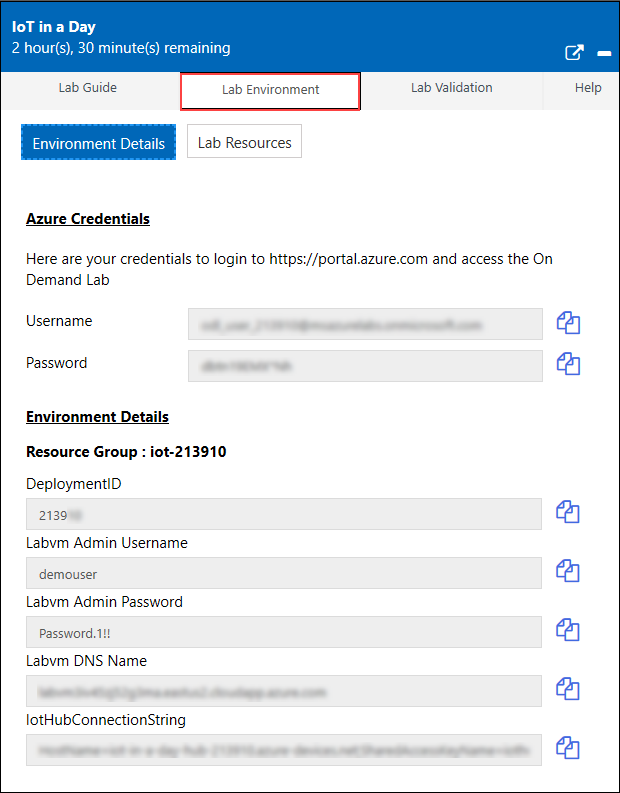

# Getting Started with Azure

## Lab Scenario

Fabrikam, Inc. creates solutions for the oil and gas manufacturing industry. They build and deploy *rod pumps - the iconic pivoting pumps that dot oil fields around the world.*

COVID-19 has forced them to explore how IoT solutions can help empower remote work and collaboration, while increasing the productivity and reducing the operational expenses. 

Specifically Fabrikam want to build a customizable solution that can scale across their global operations. Also, they want to ensure their solution covers data store, processing and analytics, be able to integrate intelligence both in the cloud and on-prem/edge, and ensure the data can be integrated into their existing business applications. 

You are one among the team members select by the CTO to become familiar with the Azure tools and put together a quick proof of concept.

## In This Lab

In this lab, you will become familiar with the Azure portal and you will explore the already created Azure Resources. The lab includes the following exercises:

* Explore the Azure Portal
* Explore pre-provisioned Azure resources in the Resource Group

## Lab Instructions

### Getting Started with Lab

1. Once the environment is provisioned, a virtual machine (JumpVM) and lab guide will get loaded in your browser. Use this virtual machine throughout the workshop to perform the the lab.

1. To get the lab environment details, you can select **Lab Environment** tab. Additionally, the credentials will also be emailed to your email address provided at registration.

   

 > You will see Suffix/DeploymentID value on **Lab Environment** tab, use it whereever you see SUFFIX or DeploymentID in lab steps.
 
### Exercise 1: Explore the Azure Portal and Dashboard

Before you begin working with the Azure IoT services, it's good to be familiar with how Azure itself works.

Although Azure commonly referred to as a 'cloud', it is actually a web portal that is designed to make Azure resources accessible from a single web site. All of Azure is accessible through the Azure portal.

#### Task 1: Examine the Azure portal Home page

1. In the JumpVM, click on Azure portal shortcut of Microsoft Edge browser which is created on desktop.

     

1. When you click on Azure portal, edge browser welcome screen will come up, select **Get started**.

   

1. On next window, click on **Confirm**.

   

1. Now, you can close the popup which is coming up.

   

1. Now, you will see two tabs in edge browser, close first tab named with **Microsoft Edge**.

   

1. On **Sign in to Micsoft Azure** tab you will see login screen, in that enter following email/username and then click on **Next**. 
   * Email/Username: <inject key="AzureAdUserEmail"></inject>

    

1. Now enter the following password and click on **Sign in**.
   * Password: <inject key="AzureAdUserPassword"></inject>

    

1. If you see the pop-up **Stay Signed in?**, click No

1. If you see the pop-up **You have free Azure Advisor recommendations!**, close the window to continue the lab.

1. If a **Welcome to Microsoft Azure** popup window appears, click **Maybe Later** to skip the tour.
   
1. In the upper left corner of the portal window, to open the Azure portal menu, click the hamburger menu icon.

    At the top of the portal menu, you should see a section containing four menu options:

    * The **Create a resource** button opens a page displaying the services available through the Azure Marketplace, many of which provide free options. Notice that services are grouped by technology, including "Internet of Things", and that a search box is provided.
    
    * The **Home** button opens a customized page that displays links to Azure services, your recently accessed services, and other tools.
    
    * The **Dashboard** button opens a page displaying your default (or most recently used) dashboard. 

    * The **All services** button opens a page similar to the **Create a resource** button described above.

    The bottom section of the portal menu is a **FAVORITES** section that can be customized to show your favorite, or most commonly used, resources. Later in this lab, you will learn how to customize this default list of common services to make it a list of your own favorites.

1. On the Azure portal menu, click **Home**.

    The Home page provides a customized view of recently used resources and services, as well as other helpful links.

2. On the home page, under **Tools**, click **Azure Monitor**.

    Azure Monitor is a tool that can help you to manage your Azure resources. You will be using Azure Monitor later in this course when you have implemented the services that comprize your IoT solution.

3. On the left side navigation menu, to display a map of data center regions, click **Service Health**.

    Notice the dropdowns for **Subscription**, **Region**, and **Service**. When you subscribe to a resource in Azure you'll pick a region to deploy it to. Azure is supported by a series of regions placed all around the world.

    This map shows the current status of regions associated with your subscription(s). A green circle is used to indicate that services are running normally at that region.

    With any cloud vendor (Azure, AWS, Google Cloud, etc.), services will go down from time to time. If you see a blue 'i' next to a region on the Service Health map, it means the region is experiencing a problem with one or more services. Azure mitigates these issues by running multiple copies of your application in different regions (a practice referred to as *Geo-redundancy*). If a region experiences an issue with a particular service, those requests will roll over to another region to fulfill the request. This is one of the big advantages of hosting apps in the Azure cloud. Azure deals with the issues, so you don't have to.

4. In the upper-left corner of your Azure portal, to navigate back to your home page, click **Home**.

    You can also use the portal menu to perform some simple navigation. You will have a chance to try out some options for portal navigation shortly.

#### Task 2: Explore the Azure Service options

1. Open the Azure portal menu, and then click **All services**.

    The All services page provides you with a few different viewing options and access to all of the PaaS, IaaS, and SaaS services that Azure offers. The first time that you open the All services page, you will see the Overview page. This view is accessible from the left side menu.

    > **Definitions**: The term **PaaS** is an acronym for **Platform as a Service**, the term **IaaS** is an acronym for **Infrastructure as a Service**, and the term **SaaS** is an acronym for **Software as a Service**

2. On the **All services** page, on the left side menu under **Categories**, click **All**.

    This view displays all of the services organized into groups corresponding to each Category. The Search box at the top can be very helpful.

3. On the left side menu, under **Categories**, click **Internet of Things**.

    The list of services is now limited to the services directly related to an IoT solution.

    Service/Resource pages on the Azure portal are sometimes referred to as _blades_. When you opened the Service Health page a couple of steps back, you opened a Service Health blade.

    The Azure portal uses blades as a kind of navigation pattern, opening new blades to the right as you drill deeper and deeper into a service. This gives you a form of breadcrumb navigation as you navigate horizontally, and Azure provides a File Explorer style path at the top of the blade that is clickable. For example: Home > Monitor > Service Health. But not every page is a blade. You will get used to it pretty quickly.

4. On the **All services** page, hover your mouse pointer over **IoT Hub**.

    A dialog box should be displayed. In the top-right corner, notice the "star" shape. When the star shape is filled-in, the service is selected as a favorite. Favorites will appear on the list of your favorite services on the left navigation menu of the portal window. This makes it easier to access the services that you use most often. You can customize your favorites list by selecting the services that you use most.

5. In the top-right corner of the IoT Hub dialog, to add IoT Hub to the list of your favorite services, click the star shaped icon.

    The star should now appear filled. If the star is shown as an outline, click the star icon again.

    > **Tip**: When you add a new item to your list of favorites, it is placed at the bottom of the favorites list on the Azure portal menu. You can rearrange your favorites into the order that you want by using a drag-and-drop operation.

6. Use the same process to add the following services to your favorites: **Device Provisioning Services**, **Logic Apps**, **Stream Analytics jobs**, and **Storage Accounts**.

    > **Note**: You can remove a service from the list of your favorite services by clicking the star of a selected service.

7. On the left side menu, under **Categories**, click **General**.

8. Ensure that the following services are selected as favorites:

    * **Subscriptions**
    * **Resource groups**

    The favorites that you've added are enough to get you started, but you can use the Internet of Things category to add additional favorites to the portal menu if you want.

#### Task 3: Examine the Toolbar menu

1. Notice the toolbar at the top of the portal that runs the full width of the window.

    In addition to the hamburger menu icon on the far left of this toolbar, there are several tool items that you will find helpful.

    First, notice that you have a _Search resources_ tool that can be used to quickly find a particular resource.

    To the right of the search tool are several buttons that provide access to common tools. You can hover the mouse pointer over a button to display the button name.

    * The _Cloud Shell_ button opens an interactive, authenticated shell right in the portal window that you can use to manage Azure resources. The Azure Cloud Shell supports Bash and PowerShell.
    
    * The _Directory + Subscriptions_ button opens a pane that you can use to manage your Azure subscriptions and account directory (the Azure Active Directory authentication mechanism).
    
    * The _Notifications_ button that opens a notifications pane. The notifications pane is useful when working with a long running process. You will be monitoring notifications when you create and configure resources throughout this course.
    
    * There are also buttons for *Settings*, *Help*, and *Feedback*. The *Help* button contains links to help documents and a list of useful keyboard shortcuts.

    On the far right is a button for your account information, providing you with access to things like your account password and billing information.

1. On the toolbar, click **Help**, and then click **Help + support**

1. On the **Help + support** blade, notice the four Tiles for _Getting started_, _Documentation_, _Billing FAQs_, and _Support plans_.

    The Help + support blade gives you access to lots of great resources. You may want to come back to this later for further exploration.

1. On the **Help + support** blade, click **Billing FAQs**

    A new browser tab should open to display Azure billing documentation.

1. Take a moment to scan the contents of the **Prevent unexpected charges with Azure billing and cost management** page. 

    If *you* are using a paid Azure subscription and you are responsible for billing (you are the Account Administrator), you can set up cost alerts to help manage your billing.

#### Task 4: Explore existing resources in the Resource Group.

1. On the Azure portal menu, click **Resource groups**

    This blade displays all of the resource groups that you have access on the Azure subscription.

2. From the list, select **iot-{deployment-id}** and explore through the pre-created resources that are available in the resource group.
