# Exercise 1: Getting Started with Azure IoT Services

## Scenario

*Turbine (devices)* are deployed across the globe. You need to configure the solution to receive telemetry and manage all the devices centrally in a reliable/scalable fashion.

## Overview

In this exercise, you will connect devices deployed across the globe to Azure IoT Hub and manage all the devices centrally in a reliable/scalable fashion and, configure the solution to receive telemetry.

This exercise includes the following tasks:

* Login to Azure Portal and verify the existing/pre-deployed resources
* Connect device (simulated) to Azure IoT Hub
* Verify telemetry stream from Azure IoT Hub using IoT Explorer

## Instructions

### Getting Started with Lab

1. Once the environment is provisioned, a virtual machine (JumpVM) on the left and lab guide on the right will get loaded in your browser. Use this virtual machine throughout the workshop to perform the lab.

1. To get the lab environment details, you can select the **Lab Environment** tab, you can locate the **Lab Environment** tab on upper right corner. Additionally, the credentials will also be emailed to your email address provided during registration.

   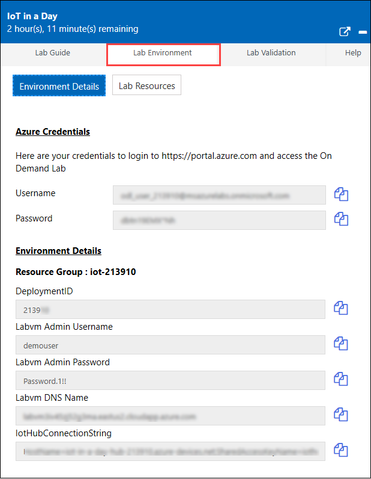

 > You will see Suffix/DeploymentID value on **Lab Environment** tab, use it wherever you see SUFFIX or DeploymentID in lab steps.
 
#### Task 1: Log in to Azure Portal and verify the existing/pre-deployed resources

1. In the JumpVM, click on the Azure portal shortcut of the Microsoft Edge browser which is created on the desktop.

   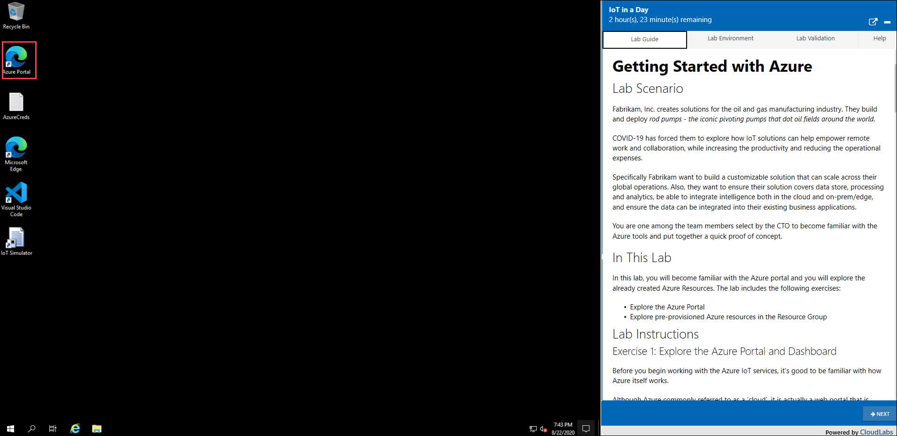  

1. On **Sign in to Microsoft Azure** blade, you will see a login screen, in that enter following email/username and then click on **Next**. 
   * Email/Username: <inject key="AzureAdUserEmail"></inject>

1. Now enter the following password and click on **Sign in**.
   * Password: <inject key="AzureAdUserPassword"></inject>

1. If you see the pop-up **Stay Signed in?**, click No

1. If you see the pop-up **You have free Azure Advisor recommendations!**, close the window to continue the lab.

1. If a **Welcome to Microsoft Azure** popup window appears, click **Maybe Later** to skip the tour.
   
1. In the upper left corner of the portal window, to open the **Resource Groups** menu, click the hamburger menu icon and then click on **Resource groups**.

   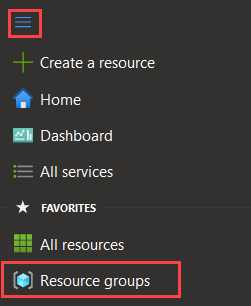

   This blade displays all of the resource groups that you have access to the Azure subscription.

1. From the list, select **iot-{deployment-id}** and explore through the pre-created resources that are available in the resource group.

   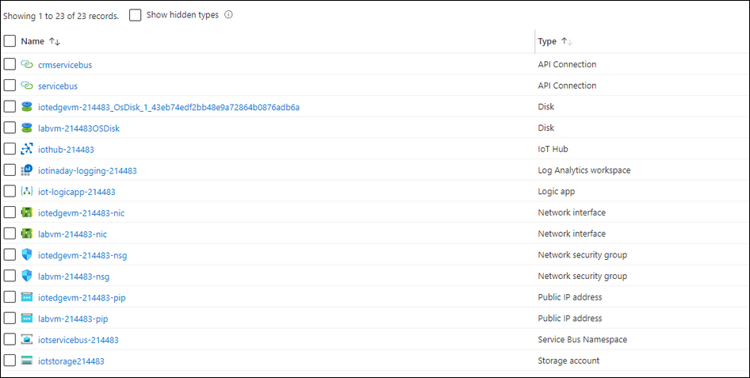  

   > **Note:** **Deployemnt id** is the unique number per deployment. You can find your deployment id from the **Lab Environment** tab on upper right corner.
    
#### Task 2: Connect Turbine device (simulated) to Azure IoT Hub

In this task, you will connect the Turbine Devices to Azure IoT Hub.

1. From the **Environment Details** Tab on the right, copy the value of **IotHubConnectionString**. This connection string will be used in the next steps to establish a connection between the IoT hub and the Simulator App,and also to establish connection with Azure IoT Explorer.

  > **Note**: You can also get the connection string by navigating to IoT Hub -> click Shared Access policies under settings -> Then click on iothubowner under Policy Tab and copy the Connection string - primarykey value.

1. Minimize the azure portal and open the **IoT Simulator App** by clicking on the **IoT simulator** shortcut that is there on the virtual machine desktop. 

1. Paste the **Connection string** value which you copied earlier in the textbox.

1. Click **Connect** button on the right to establish a connection with IoT Hub.

1. Once the connection is successful, you will see a pop-up message **Connection Successful**, Click **OK** and you will be able to see the list of simulated devices. 

   
   
1. Click on **Register** which is next to the **turbine-01** on the IoT Simulator app dialog to register the device to the IoT Hub.

   

1. Minimize the **IoT Hub Simulator App** and navigate to the resource group, select the IoT Hub named **iothub-{deployment-id}**.

1. Click **IoT devices** under Explorers section and you can observe the registered IoT devices we have registered in the previous steps.
 
   

1. Open the Iot Simulator App and click on **Activate** button next to the registered device to simulate changing the device status from disabled to enabled in the IoT Hub Registry.

   

   > **Note: Repeat the above steps to register and activate all the devices**. 
                  
1. At this point, you have registered and activated devices. To view this list of devices, Switch over to the Azure Portal and select the IoT Hub **iot-hub-{deployment-id}** .

  > **Note: You may have to refresh the browser in order to see the devices**. 

1. From the IoT Hub blade, select IoT Devices under Explorers on the left-hand menu.

1. You should see all the devices listed, with the ones that you activated having a status of enabled.

1. Click on **Send Telemetry**. Within a few moments, the grid on the bottom will list each telemetry message transmitted and the simulated temperature value.

   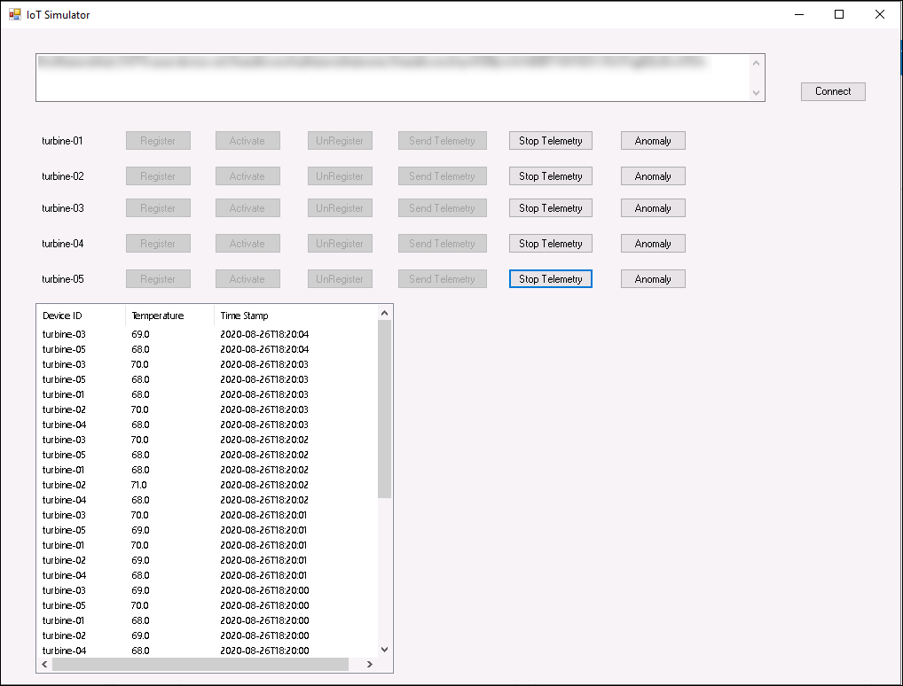
   
#### Task 3: Verify telemetry stream from Azure IoT Hub using IoT Explorer

In this task, you will use the Azure IoT Explorer to verify telemetry sent by the simulated device is being received by Azure IoT Hub.

1. Open the Azure IoT Explorer application from the Desktop by clicking on **Azure IoT Explorer** .

1. Click on **+ Add connection** on the Iot Hub pane.

   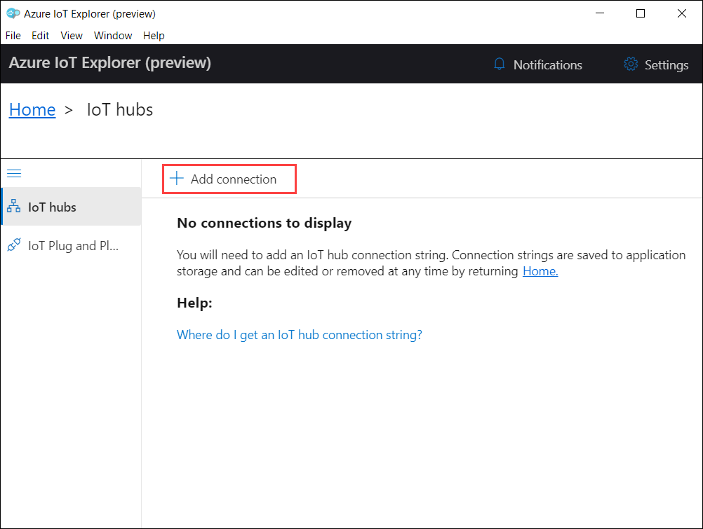

1. Paste the **Connection string** value which you copied earlier in the textbox area provided.

   > **Note**: You can find the **Connection string** value at **IotHubConnectionString** under **Environment Details** tab at the right of the workspace.
   
1. Click **Save**

   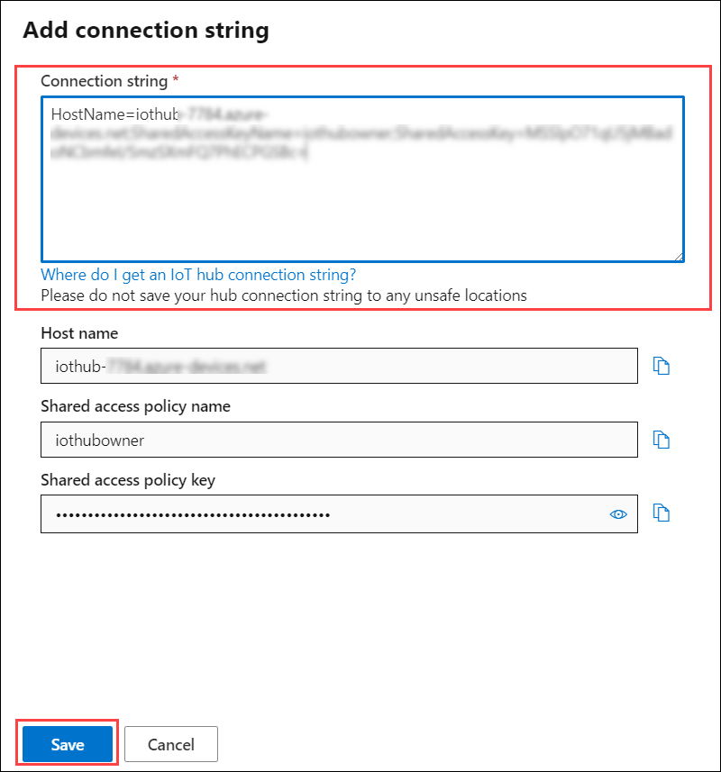

1. Under the **Devices** pane you can see the **IoT devices** you have connected and registered in the previous task.

1. Select **turbine-01** from the list of Devices.

   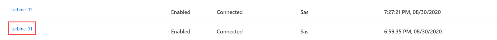

1. Select **Telemetry** from the left hand side and click on the **Start** option.

   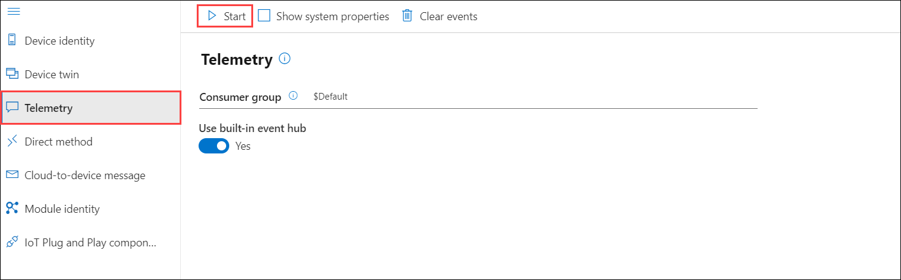

   This enables you to monitor the events being sent to the IoT hub. You are also verifying that the device can connect to and communicate with your IoT hub.

1. After 2-3 minutes you will receive telemetry events and you should be seeing messages displayed that are similar to the following:
    
   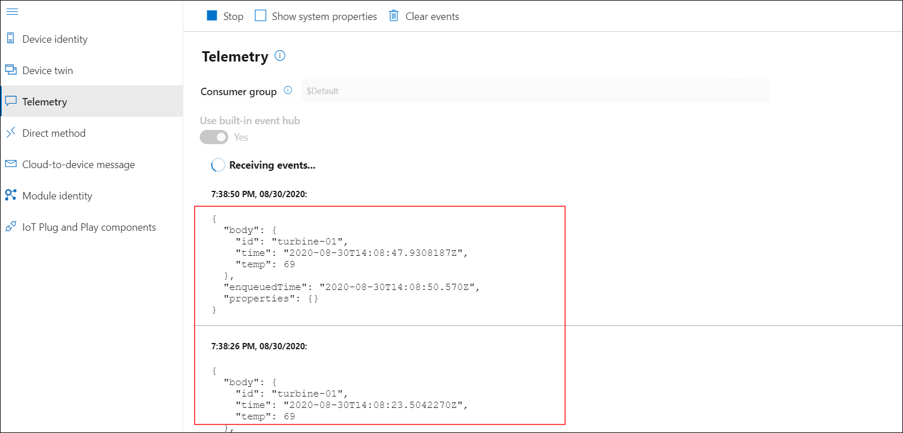
  
1. Once you have verified that IoT hub is receiving the telemetry, press **Stop** and then close **Azure IoT Explorer** application.

   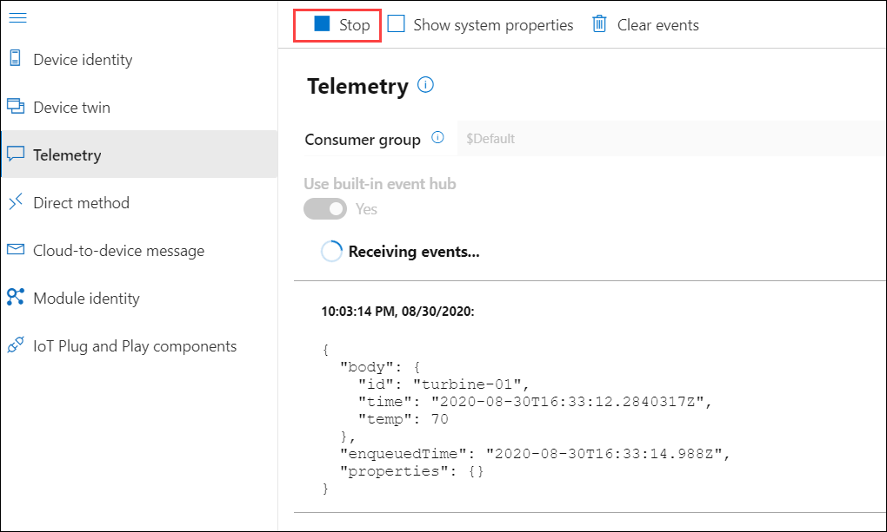
