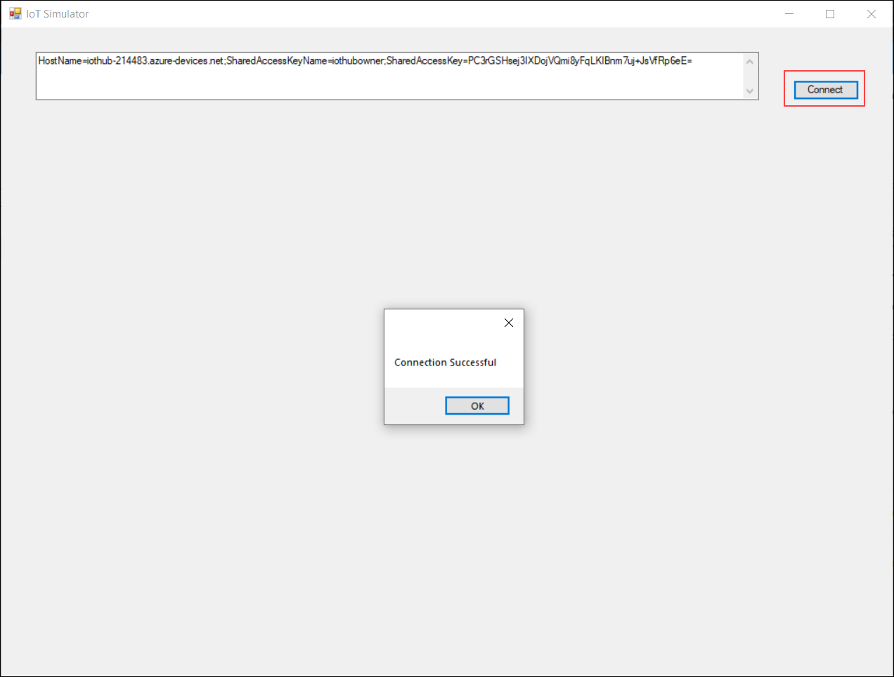
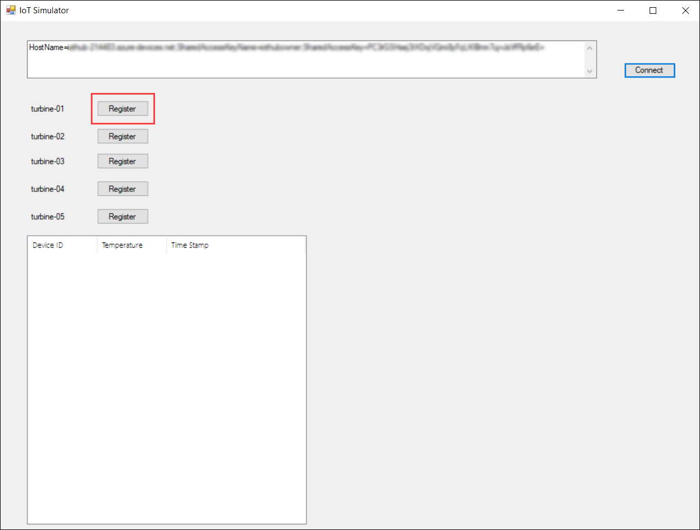
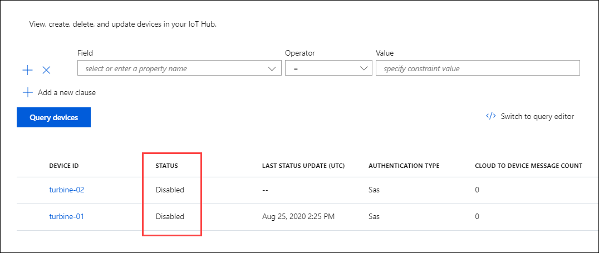
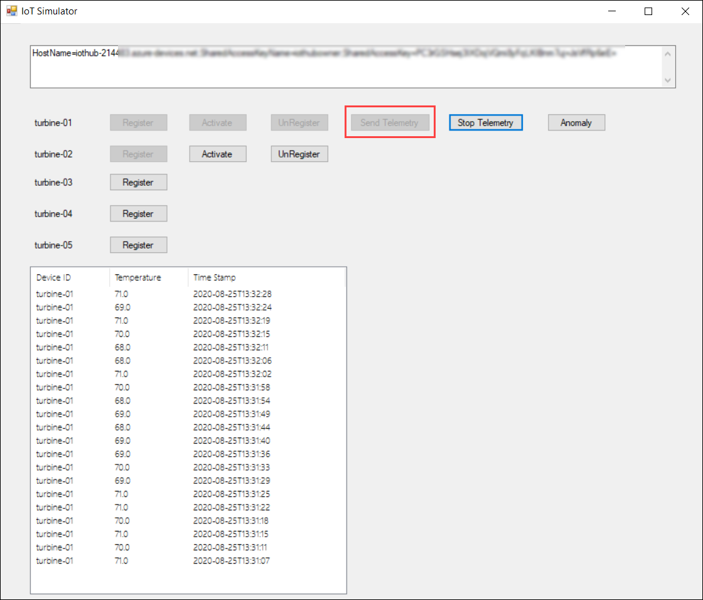
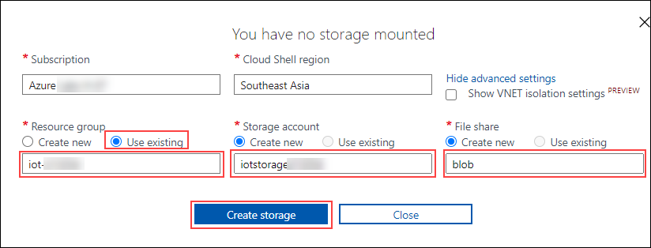

# Getting Started with Azure IoT Services

## Lab Scenario

*Rod pumps (devices)* are deployed across the globe. You need to configure the solution to receive telemetry and manage all the devices centrally in a secure / reliable / scalable fashion.

## In this Lab

In this lab, you will examine an Azure IoT Hub and an IoT Hub Device Provisioning Service. The lab includes the following exercises:

* Examine features of the IoT Hub service
* Examine features of the Device Provisioning Service
* Connect device (simulated) to Azure IoT Hub
* Verify telemetry stream from Azure IoT Hub

## Lab Instructions

### Exercise 1: Examine the IoT Hub Service

**Azure IoT Hub** - IoT Hub is a managed service, hosted in the cloud, that acts as a central message hub for bi-directional communication between your IoT application and the devices it manages. You can use Azure IoT Hub to build IoT solutions with reliable and secure communications between millions of IoT devices and a cloud-hosted solution backend. You can connect virtually any device to IoT Hub.

IoT Hub's capabilities help you build scalable, full-featured IoT solutions such as managing industrial equipment used in manufacturing, tracking valuable assets in healthcare, monitoring office building usage, and many more scenarios. IoT Hub monitoring helps you maintain the health of your solution by tracking events such as device creation, device failures, and device connections.

In this exercise, you will examine some of the features that IoT Hub provides. 

#### Task 1: Explore the IoT Hub Overview information

1. On the resource group tile, click **iot-{deployment-id}** and select the existing iothub named **iot-in-a-day-hub-{deployment-id}**.

    When you first open your IoT Hub blade, the **Overview** information will be displayed. As you can see, the area at the top of this blade provides some essential information about your IoT Hub service, such as datacenter location and subscription. But this blade also includes tiles that provide information about how you are using your hub and recent activities. Let's take a look at these tiles before exploring further.

1. At the bottom-left of your IoT Hub blade, notice the **IoT Hub Usage** tile.

    > **Note**:  The tiles positions are based upon the width of the browser window, so the layout may be a little different than described.

    This tile provides a quick overview of what is connected to your hub and message count. As you add devices and start sending messages, this tile will provide nice "at-a-glance" information.

2. To the right of the **IoT Hub Usage** tile, notice the **Device to cloud messages** tile.

    The **Device to cloud messages** tile provides a quick view of the incoming messages from your devices over time. You will be registering a device and sending messages to your hub during a lab in the next module, so you will begin to see information on these tiles pretty soon.

#### Task 2: View features of IoT Hub using the left-side menu

1. On the IoT Hub blade, take a minute to scan the left-side menu options.

    As you would expect, these menu options are used to open panes that provide access to properties and features of your IoT Hub. For example, some panes provides access to devices that are connected to your hub.

2. On the left-side menu, under **Explorers**, click **IoT devices**

    This pane can be used to add, modify, and delete devices registered to your hub. You will get pretty familiar with this pane by the end of this course.

3. On the left-side menu, near the top, click **Activity log**

    As the name implies, this pane gives you access to a log that can be used to review activities and diagnose issues. You can also define queries that help with routine tasks. Very handy.

4. On the left-side menu, under **Settings**, click **Built-in endpoints**

    IoT Hub exposes "endpoints" that enable external connections. Essentially, an endpoint is anything connected to or communicating with your IoT Hub. You should see that your hub already has two endpoints defined:

    * _Events_
    * _Cloud to device messaging_

5. On the left-side menu, under **Messaging**, click **Message routing**

    The IoT Hub message routing feature enables you to route incoming device-to-cloud messages to service endpoints such as Azure Storage containers, Event Hubs, and Service Bus queues. You can also create routing rules to perform query-based routes.

6. At the top of the **Message routing** pane, click **Custom endpoints**.

    Custom endpoints (such as Service Bus queue and Storage) are often used within an IoT implementation.

7. Take a minute to scan through the menu options under **Settings**

    > **Note**:  This lab exercise is only intended to be an introduction to the IoT Hub service and get you more comfortable with the UI, so don't worry if you feel a bit overwhelmed at this point. You will be configuring and managing your IoT Hub, devices, and their communications as this course continues.


### Exercise 2: Connect devices (simulated) to Azure IoT Hub

#### Task 1: Connect device to IoT Hub

1. Get the IotHubConnectionString from the **Environment Details** Tab or you can obtain the connection string by going into IoT Hub, click **Shared Access policies** under settings and then click **iothubowner** under Policy Tab and copy the **Connection string - primarykey** value to establish connection between IoT hub and the Simulator App.

1. Minimize the azure portal and open the **IoT Simulator App** by clicking on the **IoT simulator** shortcut that is there on the virtual machine desktop. 

1. Paste the **Connection string** value which you copied earlier in the textbox.

1. Click **Connect** button on the right to establish connection with IoT Hub.

1. Once the connection is successful, you will see a pop-up message **Connection Successfull** and you will be able to see the list of simulated devices. 

   
   
1. Click on **Register** which is next to the **turbine-01** on the IoT Simulator app dialog to register device to the IoThub.

   

1. Minimise the **IoT Hub Simulator App** and navigate to the **Iot hub**.

1. Click **IoT devices** under Explorers section and you can observe the registered IoT devices we have registerd in the above instruction.
 
   

1. Click on **Activate** to simulate changing the device status from disabled to enabled in the IoT Hub Registry.

   

    
      > **Note: Repeat the above steps to register and activate all the devices**.

1. At this point, you have registered and activated devices. To view this list of devices, Switch over to the Azure Portal and select the IoT Hub **iot-in-a-day-hub-{deployment-id}** .

1. From the IoT Hub blade, select IoT Devices under Explorers on the left-hand menu.

1. You should see all the devices listed, with the ones that you activated having a status of enabled.

1. Click on **Send Telemetry**. Within a few moments, the grid on the bottom will list each telemetry message transmitted and the simulated temperature value.

   

### Exercise 4: Verify telemetry stream from Azure IoT Hub

In this task, you will use the Azure CLI to verify telemetry sent by the simulated device is being received by Azure IoT Hub.

1. Open the Azure Cloud Shell by navigating to **https://shell.azure.com**. Log in using your Azure subscription credentials if prompted to do so, select a **PowerShell** session, and accept any prompts.

1. If you got a prompt for creating storage account, click on **Show advanced settings** and select existing Resource Group as **iot-{deployment-id}** and enter **iotstore{deployment-id}** for storage account name and Enter **blob** for File Share 

   >**Note**: - You can get the **deployment-id** details from your environment details page.
        
   

1. In the Azure Cloud Shell, enter the following command to install **Azure-IoT** extension:

    ```cmd/sh
    az extension add --name azure-iot
    ```

1. In the Azure Cloud Shell, to monitor the event messages that are being received by your IoT hub, enter the following command:

    ```cmd/sh
    az iot hub monitor-events --hub-name {IoTHubName} --device-id {Device ID}
    ```

    > **Note**:Be sure to replace both the **{IoTHubName}** and **{Device ID}** placeholder with the name of your Azure IoT Hub and with the Device ID like **turbine-01**

    > **Note**:  If you receive a message stating _"Dependency update required for IoT extension version"_ when running the Azure CLI command, then press `y` to accept the update and press `Enter`. This will allow the command to continue as expected.

    The `monitor-events` command (within the `az iot hub` Azure CLI module) offers the capability to monitor device telemetry and other message types sent to an Azure IoT Hub. This can be a very useful tool during code development, and the convenience of the command-line interface is also nice.

    The `--device-id` parameter is optional and allows you to monitor the events from a single device. If the parameter is omitted, the command will monitor all events sent to the specified Azure IoT Hub.

1. Notice that the `az iot hub monitor-events` Azure CLI command outputs a JSON representation of the events that are arriving at your specified Azure IoT Hub. 

    This command enables you to monitor the events being sent to IoT hub. You are also verifying that the device is able to connect to and communicate with the your IoT hub.

    You should see messages displayed that are similar to the following:

    ```cmd/sh
    Starting event monitor, filtering on device: turbine-01, use ctrl-c to stop...
    {
        "event": {
            "origin": "turbine-01",
            "module": "",
            "interface": "",
            "component": "",
            "payload": "{\"id\":\"turbine-01\",\"time\":\"2020-08-14T12:50:48.4702636Z\",\"temp\":69.0}"
        }
    }
    {
        "event": {
            "origin": "turbine-02",
            "module": "",
            "interface": "",
            "component": "",
            "payload": "{\"id\":\"turbine-01\",\"time\":\"2020-08-14T12:48:21.7545040Z\",\"temp\":70.0}"
        }
    }
    ```

1. Once you have verified that IoT hub is receiving the telemetry, press **Ctrl-C** in the Azure Cloud Shell.

      >**Note**: Always remember to shut down unneeded apps and jobs after the lab is finished.

