# Exercise 2: Processing Data from Azure IoT Hub 

## Scenario

You will need to store all data coming from Turbine devices in long-term storage for the cold path analysis and filter a subset of the telemetry data for real-time analysis and visualization on the hot path using PowerBI and TSI Explorer.

## Overview

In this exercise, you will use Stream Analytics to process and transform the data in IoT Hub. Also, you will store all data in blob storage for Cold path analysis and filter a subset of the telemetry data for real-time analysis and visualization on the hot path in PowerBI.

This includes the following tasks:

* Start Stream Analytics Job
* Check data in blob storage using Storage Explorer
* Visualize hot path data in PowerBI
* View Time Series Insights Explorer

### Task 1: Start Stream Analytics Job

In this task we will run a predefined **Stream Analytics Job** to process and transform the data from IoT Hub to storage account and also to PowerBI.

1. Navigate to Azure Portal( https://portal.azure.com ). From the resource group **iot-{deployment-id}**, select the stream analytics job named **iot-streamjob-{deployment-id}**.

1. Then under Job Topology on the left side of the blade, select **Inputs**  and verify that there is one input job already defined which input source set as IoT Hub.

   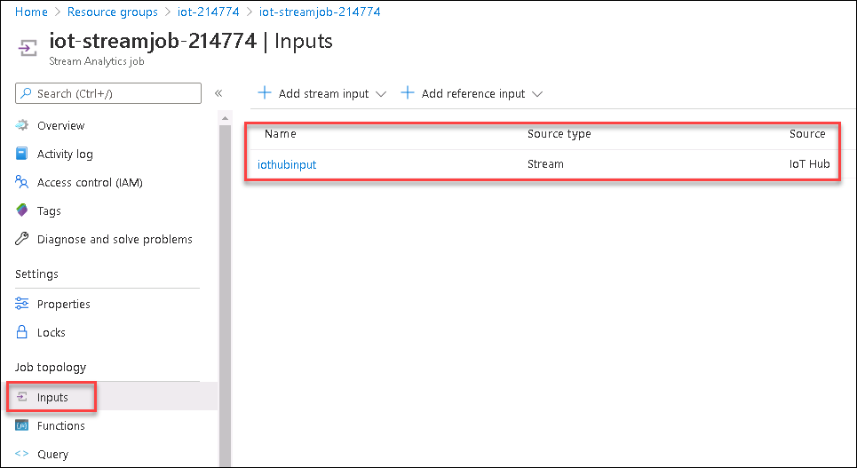

1. Then select **Outputs** under Job Topology and select **powerbioutput** 

1. Then, in the blade that comes up, click on **Renew authorization**.

   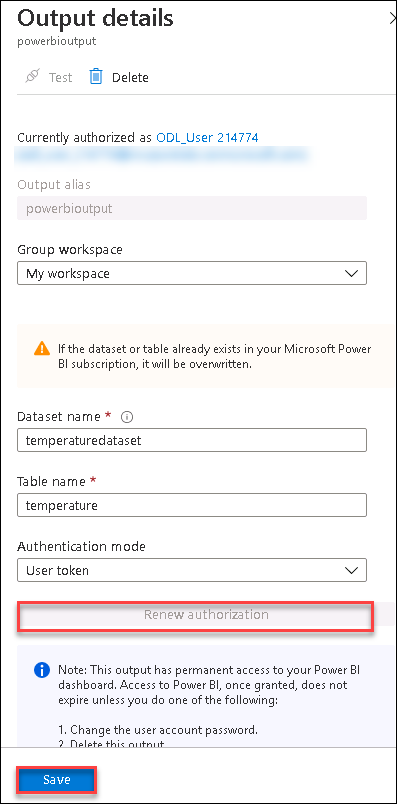

1. When prompted for Azure Credentials, provide the  **Azure Username** <inject key="AzureAdUserEmail"></inject> and **Password** <inject key="AzureAdUserPassword"></inject> from the environment details tab and click on **Save**.

1. From the **Overview** blade of your **Stream Analytics job** now we will observe the query used to transform and analyze the data: 

       SELECT * INTO bloboutput FROM iothubinput; 
 
   > **Note**: This query selects all the telemetry data from the **iothubinput** and sends it to the **bloboutput**. For this basic query we don't have to use Azure Stream Analytics Job, instead we can use [**message routing**](https://docs.microsoft.com/en-us/azure/iot-hub/iot-hub-devguide-messages-d2c) functionality of Azure IoT Hub itself to store the data in storage account. In Azure Stream Analytics we we will be able to process the data and transform it like in the next query.

      SELECT AVG(temp) AS Average, id  INTO powerbioutput  FROM iothubinput  GROUP BY TumblingWindow(minute, 1), id;

   > **Note**: This query looks at the events coming into the "iothubinput" Input and groups by a Tumbling Window of one minute. And then sends the average of temperature and id to the "powerbioutput" Output, For more information about the `TumblingWindow` functions, reference this link: [https://docs.microsoft.com/en-us/stream-analytics-query/tumbling-window-azure-stream-analytics]

1. On Overview page itself click on **Start**.

1. In the **Start job** blade, select **Now** (the job will start proces>sing messages from the current point in time onward) and click on **Start**.

1. It will take a few minutes for the Stream Analytics Job to get started and once started the Status on the overview blade will change to Running.
   
   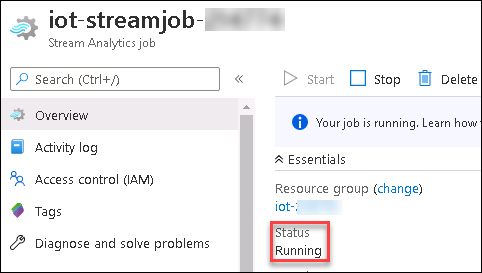

1. Once the Stream Analytics Job has successfully started, verify that you are showing a non-zero amount of **Input Events** on the **Monitoring** chart on the **Overview** blade. 

   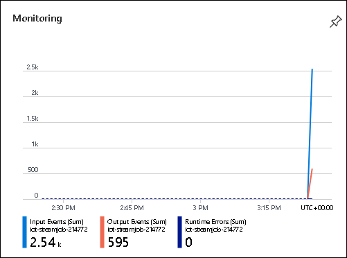
 
  > **Note:** If you don't see the data, you will need to reconnect your devices on the IoT Simulator by deactivating and registering the devices again and then let it run for a while to see the events.
  
### Task 2: Check data in blob storage using Storage Explorer

In this task, we will observe the data stored in the storage account **iotstorage{deployment-id}** when we ran the job in the previous task.

1. Navigate to the resource group iot-{deployment-id} and select the storage account named **iotstorage{deployment-id}**.

1. On the left-side menu, click **Storage Explorer (preview)**.

    You can use Storage Explorer for additional reassurance that all of your data is getting to the storage account. 

1. In **Storage Explorer (preview)**, under **BLOB CONTAINERS**, click **temperaturecontainer**.
 
1. In the right-hand pane, under **Name**, double-click the folder **output** to see the data . 

   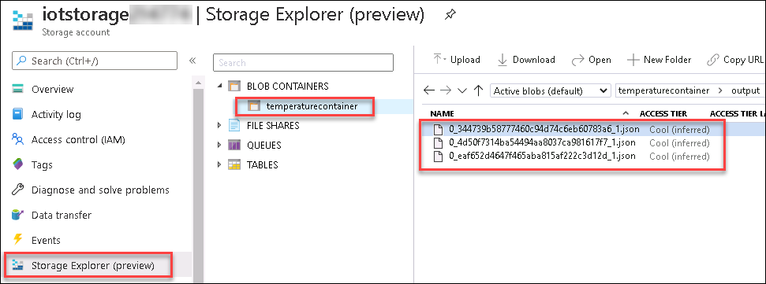

 
### Task 3: Visualize hot data with Power BI

1. Sign in to your Power BI subscription (<https://app.powerbi.com>) using the lab credentials to see if data is being collected.

1. Select **My Workspace** on the left-hand menu, then select the **Datasets tab**, and locate the **temperaturedataset** dataset from the list.

   > **Note:** Sometimes it takes few minutes for the dataset to appear in the Power BI Dataset tab under **My Workspace**.

1. Select the **Create Report** button under the **Actions** column.
  
   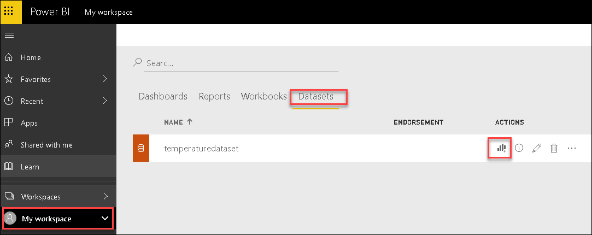
   
1. On the **Visualizations** palette, select **Stacked column chart** to create a chart visualization.

   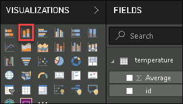

1. In the **Fields** listing, drag the **id** field, and drop it into the **Axis** field.

1. Next, drag the **average** field and drop it into the **Values** field.

   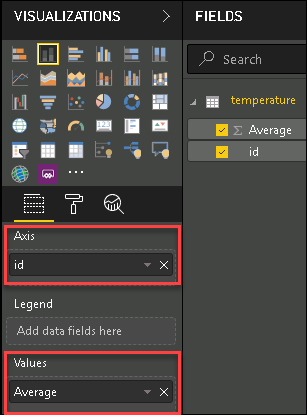

1. Now, set the **Value** to **Max of average**, by selecting the down arrow next to **average**, and select **Maximum**.

   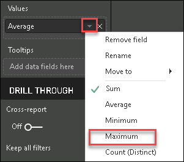

1. Repeat steps 4-6, this time adding a Stacked Column Chart for **Min of average** by selecting the down arrow next to **average**, and select **Minimum**. 
   
   > **Note:** You may need to select on any area of white space on the report designer surface to deselect the Max of average by id chart visualization.

1. Next, add a **table visualization**.

   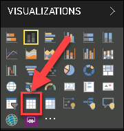

1. Set the values to **id** and **Average**, by dragging and dropping both fields in the **Values** field, then selecting the dropdown next to **average**, and selecting **Average** in the average field.

   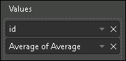

1. Go to File, from the dropdown Select **Save** to save the report.

   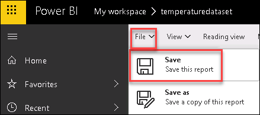

1. Enter the name `Average Temperatures`, and select **Save**.

1. Within the report, select one of the columns to see the data for just that device.
   
### Task 4: View Time Series Insights Explorer 

**Azure Time Series Insights (TSI)** is an end-to-end **platform-as-a-service** offering used to collect, process, store, analyze, and query data from IoT solutions at scale. TSI is designed for ad hoc data exploration and operational analysis of data that's highly contextualized and optimized for time series.

For this task, Time Series Insights integration is already done with Azure IoT Hub and you will analyze the data in TSI Explorer

1. On the resource group tile, click **iot-{deployment-id}** and select the time series environment named **iot-tsi-{deployment-id}**.

1. On the **Time Series Insights environment** blade, at the top of the **Overview** pane, click **Go to TSI Explorer**.

   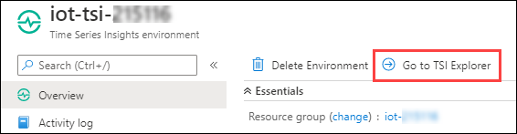

   This will open the **Time Series Insights Explorer** in a new browser tab.

1. Once logged in to TSI explorer pane you will see as shown below:

   
   
1. On the left-hand side, you will be seeing time series instances for each of the devices you have registered.

1. Since we only have data from the devices for the past 20 minutes, there is not enough data to explore the **Time Series Insights**. So we will use a built-in demo environment to explore TSI.

   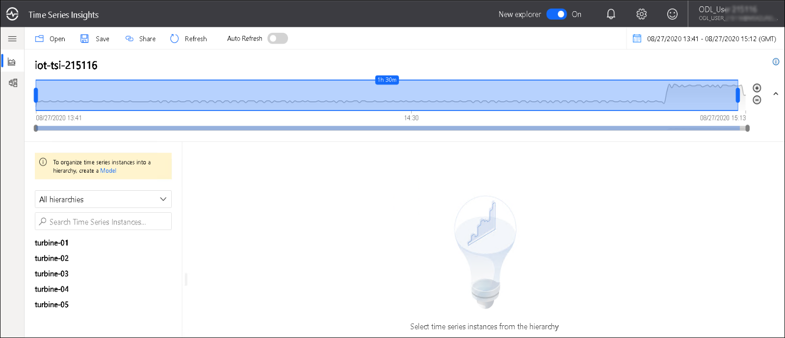
  
1. Now, to access the demo environment, click on the user pane at top right corner and select the **View Demo Environment** from the dropdown.

   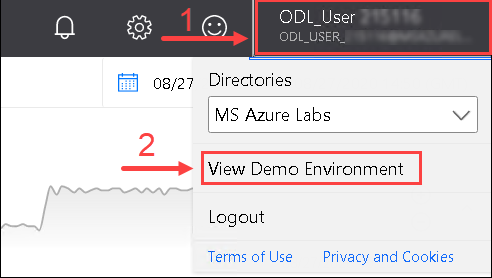
 
1. From menu on the left side, select **Analyze**, your environment will be loaded with 2 sample datasets **Contoso Plant 1** and **Contoso Plant 2**.

1. From menu on the left side, select **Model** and review the available models.

1. From menu on the left side select **Analyze**.

1. The Time Series Insights data explorer will open in a new tab. By default, a chart displaying a count of all events is displayed. Notice how there is a timeline directly underneath the chart, and a more macro-level timeline below that, showing a span of several hours.
  
1. Remove the existing queries by clicking on the **delete** icon.

   

   >**Note** : To see the delete icon, move the cursor to left side of the selected query.
      
1. On the left pane, expand Contoso Plant 1 **->** W6 **->** Weather System **->** OutdoorTemperature.

1. Click on the listed data, then select **Reading** and Click on **Add**.

   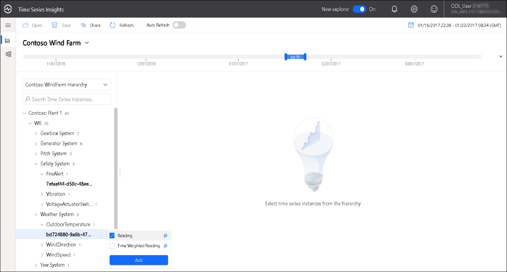

1. The line chart will be displayed with the average temperature values accordingly based on specific timespan.

1. From the **Interval** dropdown, change the interval and then observe the changes that are reflected in the graph .

1. Select Settings ( gear icon ) within the new measure you created, then check the box next to Use **Stepped Interpolation** and **Min/Max Shadows**.

1. The chart will update to reflect those changes. Notice how **Show Min/Max** creates a shadow behind the interpolated line to show the minimum and maximum temperature values. This is because the displayed line is the average temperature value.

1. You can use the Interval Size slider tool to zoom in and out of intervals over the same timespan. The slider provides more precise control of movement between large slices of time that show smooth trends down to slices as small as the millisecond, which allow you to display and analyze granular, high-resolution cuts of your data.

   

1. Click on **More Actions** which is present at the top right corner of the environment.

1. From the dropdown, select **Explore raw events**.

   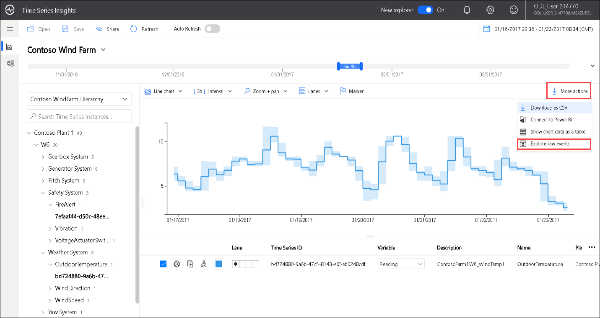

1. You may select which columns you want to view and export the data if desired by selecting **Download as CSV** which is at the left bottom of events dialog and you can close.

   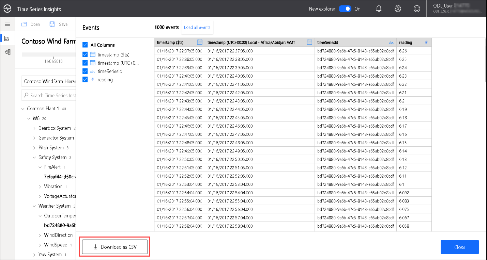
   
1. Then, Click on **More Actions** which is present at the top right corner of the environment and select **Show chart data as table**.
  
1. A table will be displayed which consists of **maximum**,**average** and **minimum temperature** between specific time intervals.

   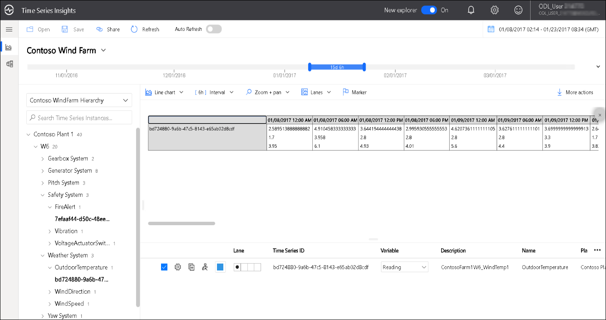

   >**Note** : Please ensure to **Stop** the Stream Analytics Job and navigate to IoT Simulator App. Then click on **Stop telemetry** button to stop sending the telemetry stream.
