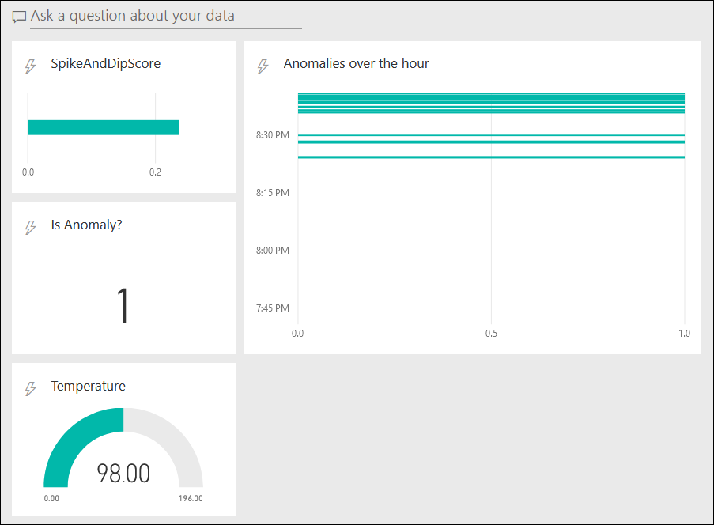
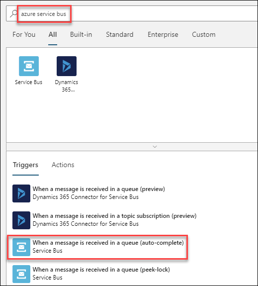
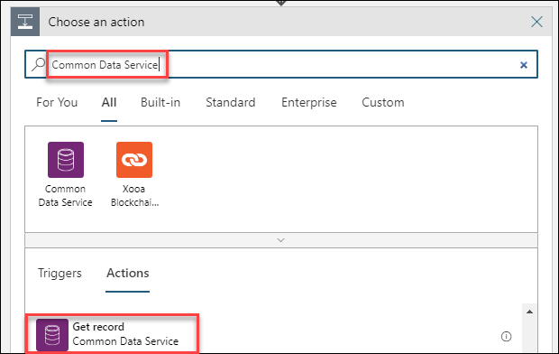
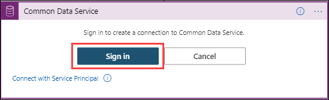
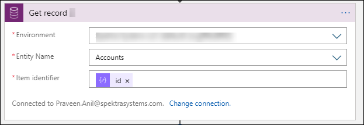

# Exercise 3: Machine Learning in IoT and Real-Time Monitoring using Power BI

## Scenario

Insights generated so far require manual involvement to detect anomalies. We need to make use of automated techniques to detect anomalies.
Up-on anomaly detection, Your team decides that further improvements to the monitoring system will require near real-time data exploration and alerting the issue needs to be escalated as soon as possible.

## Overview

In this exercise, you will use automated in-built Machine Learning models to analyze the data from the Turbine devices and detect anomalies instead of manual involvement to detect anomalies and also you will use the output from the query in previous exercise to visualize the data in a Power BI dashboard.

This exercise includes the following tasks:

* Triggering anomalies using IoT Simulator App
* Detect Anomalies using built-in Machine Learning Model
* Create a Power BI Dashboard and Visualize Anomaly Data
* Get alert when an anomaly is detected[Optional]

### Task 1: Triggering anomalies using IoT Simulator App

1. On the Desktop of the provide machine on the left, open IoT simulator app.

1. From the IoT simulator app dialog , Click on **Anomaly** button which is next to stop telemetry that sends anomalies to IoT hub.

    >**Note**: If the devices are not sending telemetry , make sure to start IoT Simulator App and simulate the devices by sending telemetry.
    
1. On the grid, list of telemetry messages that are transmitted are displayed.Observe the simulated temperature value.

### Task 2: Detect Anomalies using built-in Machine Learning Model

In this task you will be using the following ML Model:

**Built-in Machine Learning Model** - The AnomalyDetection_SpikeAndDip function uses a sliding window to analyze data for anomalies. The sliding window could be, for example, the most recent two minutes of telemetry data. The window advances in near real-time with the flow of telemetry. If the size of the sliding window is increased to include more data, the accuracy of anomaly detection will increase as well (however, the latency also increases, so a balance must be found).

1. On the resource group tile, click **iot-{deployment-id}** and select the stream analytics job named **iot-streamjob-{deployment-id}**.

   >**Note**: Please ensure that the stream analytics job is **stopped** before editing the query in the next step.

1. On the left-side menu under **Job topology**, click on **Query**.

1. Copy the following SQL query, and then append it with the existing query.

    ```sql
     WITH AnomalyDetectionStep AS
     (
       SELECT
           EventProcessedUtcTime AS time,
           CAST(temp AS float) AS temp,
           AnomalyDetection_SpikeAndDip(CAST(temp AS float), 90, 120, 'spikesanddips')
               OVER(LIMIT DURATION(second, 120)) AS SpikeAndDipScores
       FROM iothubinput
    )
       SELECT
           time,
           temp,
           CAST(GetRecordPropertyValue(SpikeAndDipScores, 'Score') AS float) AS
           SpikeAndDipScore,
           CAST(GetRecordPropertyValue(SpikeAndDipScores, 'IsAnomaly') AS bigint) AS
           IsSpikeAndDipAnomaly
      INTO powerbioutput
      FROM AnomalyDetectionStep
    ```

    > **Note**:  This first section of this query takes the temperature data, and examines the previous 120 seconds worth. The `AnomalyDetection_SpikeAndDip` function will return a `Score` parameter, and an `IsAnomaly` parameter. The score is how certain the ML model is that the given value is an anomaly, specified as a percentage. If the score exceeds 90%, the `IsAnomaly` parameter has a value of 1, otherwise `IsAnomaly` has a value of 0. Notice the 120 and 90 parameters in the first section of the query. The second section of the query sends the time, temperature, and anomaly parameters to `powerbioutput`.

1. Verify that the query editor now lists 1 Input and 3 Outputs:

    * `Inputs`
      * `iothubinput`
    * `Outputs`
      * `bloboutput`
      * `powerbioutput`     
      * `servicebusoutput`

    If you see more than 1 of each then you likely have a typo in your query or in the name you used for the input or output - correct the issue before moving on.

1. To save the query, click **Save query**.

1. On the left-side menu, click **Overview**.

1. Near the top of the blade, click **Start**.

   > **Note**: If you see the Job fails, then perform the following steps:
     *  Select **Outputs** under Job Topology and select **powerbioutput**
     * Then, in the blade that comes up, click on Renew authorization and when prompted for Azure Credentials, provide the Azure Username and Password from the environment details tab and then click on Save.

1. On the **Start job** pane, under **Job output start time**, ensure **Now** is selected, and then click **Start**.

In order for a human operator to easily interpret the output from this query, you need to visualize the data in a friendly way. One way of doing this visualization is to create a Power BI dashboard. You will be doing that in the next exercise.

### Task 3: Create a Power BI Dashboard and Visualize Anomaly Data

In the previous task, you had configured stream analytics job to process the telemetry via the ML model and output the results to Power BI. Within Power BI, you need to create a dashboard with a number of tiles to visualize the results and provide decision support for the operator.

1. In your browser, navigate again to [https://app.powerbi.com/](https://app.powerbi.com/).

1. Once Power BI has opened, on the left-side navigation menu, expand **Workspaces**, and then select the **My workspace**.

    > **Note**:  At the time of writing, Power BI has a *New Look* in preview. The steps in this task have been written assuming the *New Look* is **Off**. To turn off the *New Look*, on the toolbar at the top of the screen, ensure that the toggle reads **New look off**. 

1. On the **Datasets** tab, verify that **temperaturedataset** is displayed.
   
    If not, you might have to wait a short time for this list to populate.

1. At the top right of the page, click **+ Create**, and then click **Dashboard**.

1. In the **Create dashboard** popup, under **Dashboard name**, type **Temperature Dash** and then click **Create**.

    The new dashboard will be displayed as an essentially blank page.

1. To add a Temperature gauge, at the top of the blank dashboard, click **+ Add tile**.

1. In the **Add tile** pane, under **REAL-TIME DATA**, click **Custom Streaming Data**, and then click **Next**.

1. On the **Add a custom streaming data tile** pane, under **YOUR DATASETS**, click **temperaturedataset**, and then click **Next**.

    The pane will refresh to allow you to choose a visualization type and fields.

1. Under **Visualization Type**, open the dropdown, and then click **Gauge**.

1. Under **Values**, click **+ Add value**, open the dropdown, and then click **temp**.

    Notice that the gauge appears immediately on the dashboard with a value that begins to update!

1. To display the Tile details pane, click **Next**.

1. In the **Tile details** pane, under **Title**, enter **Temperature**.

1. To leave the remaining fields at default values and close the pane, click **Apply**.

    If you see a notification about creating a phone view, you can ignore it and it will disappear shortly (or dismiss it yourself).

1. To reduce the size of the tile, hover your mouse over the bottom-right corner of the tile, and then click-and-drag the resize mouse pointer.

    Make the tile as small as you can. It will snap to various preset sizes.

1. To add the SpikeAndDipScore Clustered Bar Chart, at the top of the dashboard, click **+ Add tile**.

1. In the **Add tile** pane, under **REAL-TIME DATA**, click **Custom Streaming Data**, and then click **Next**.

1. On the **Add a custom streaming data tile** pane, under **YOUR DATASETS**, click **temperaturedataset**, and then click **Next**.

1. Under **Visualization Type**, open the dropdown, and then click **Clustered bar chart**.

    Notice that changing the visualization type changes the fields below.

1. Under **Values**, click **+ Add value**, open the dropdown, and then click on **SpikeAndDipScore**.

1. To display the Tile details pane, click on **Next**.

1. In the **Tile details** pane, under **Title**, enter **SpikeAndDipScore**

1. To close Tile details pane, click on **Apply**.

    If you see a notification about creating a phone view, you can ignore it and it will disappear shortly (or dismiss it yourself).

1. Again, reduce the size of the tile, making it as small as you can.

1. At the top of the dashboard, to add a IsSpikeAndDipAnomaly Card visualization, click **+ Add tile**.

1. In the **Add tile** pane, under **REAL-TIME DATA**, click **Custom Streaming Data**, and then click **Next**.

1. On the **Add a custom streaming data tile** pane, under **YOUR DATASETS**, click **temperaturedataset**, and then click **Next**.

1. Under **Visualization Type**, open the dropdown, and then click **Card**.

1. Under **Fields**, click **+ Add value**, open the dropdown, and then click **IsSpikeAndDipAnomaly**.

1. To display the Tile details pane, click **Next**.

1. In the **Tile details** pane, under **Title**, enter **Is Anomaly?**

1. To close the Tile details pane, click **Apply**.

    If you see a notification about creating a phone view, you can ignore it and it will disappear shortly (or dismiss it yourself).

1. Again, reduce the size of the tile, making it as small as you can.

1. Using drag-and-drop, arrange the tiles vertically on the left of the dashboard in the following order:

    * SpikeAndDipScore
    * Is Anomaly?
    * Temperature

1. At the top of the dashboard, click **+ Add tile**.

1. In the **Add tile** pane, under **REAL-TIME DATA**, click **Custom Streaming Data**, and then click **Next**.

1. On the **Add a custom streaming data tile** pane, under **YOUR DATASETS**, click **temperaturedataset**, and then click **Next**.

    The pane will refresh to allow you to choose a visualization type and fields.

1. Under **Visualization Type**, open the dropdown, and then click **Clustered bar chart**.

    Notice that changing the visualization type changes the fields below.

1. Under **Axis**, click **+ Add value**, and then select **time** from the dropdown.

1. Under **Values**, click **+ Add value**, and then select **IsSpikeAndDipAnomaly** from the dropdown.

    Notice that the chart appears immediately on the dashboard with a value that begins to update!

1. Under **Time window to display**, to the right of **Last**, open the dropdown, and then click **60**

    Leave the units set to **Minutes**.

1. To display the Tile details pane, click **Next**.

1. In the **Tile details** pane, under **Title**, enter **Anomalies over the hour**.

1. To close the Tile details pane, click **Apply**.

    If you see a notification about creating a phone view, you can ignore it and it will disappear shortly (or dismiss it yourself).

1. This time, stretch the tile so its height matches the 3 tiles to the left and its width fits the remaining space of the dashboard.

    There is a latency with so many routes and connections, but you should start seeing the turbine temperature data in the visualizations.

    > **Note**:  If no data appears, check you are running the IoT simulator app and the analytics job is running. Also, you can start sending anomalies for few seconds and then stop it to see the fluctuations in Power BI dashboard that you have configured.

    Let the job run for a while, several minutes at least before the ML model will kick in. Compare the console output of the device app, with the Power BI dashboard. Are you able to correlate the forced and increasing vibrations to a run of anomaly detections?

1. If you're seeing an active Power BI dashboard like the below image, you've just completed this lab. Great work!

    

### Task 4: Get alert when an anomaly is detected [Optional]

**** 
**This will be a read through only task, as the provided lab environment doesn't have any D365 Licenses associated to complete this task**.
****

In this task, you will configure **Logic App** to be triggered by a **Service Bus queue** and send an alert based on the condition.

1. Navigate to your Resource group **iot-{deploymentid}** and select the logic app **iot-logicapp-{deployment-id}**.

1. Select **Blank Logic App +** tile from Logic app designer pane .

1. In the search box, enter **"azure service bus"** as your filter. From the triggers list, select the trigger **When a message is received in a queue (auto-complete) ** trigger.

   
   
1. Follow these steps when the Logic App Designer prompts you for connection information.

   * Provide a name for your connection, for example like **iotservicebusconnection**.
   * Select your **Service Bus namespace**.
   * Select your Service Bus policy, and select **Create**.

1. Select the messaging entity you want, such as a **iotqueue**
    
1. Provide the necessary information for your selected trigger. To add other available properties to the action, open the Add new parameter list, and select the properties that you want. For example, select the polling interval and frequency for checking the queue.

1. Under the step where you want to add an action, select **+ New step**.

1. Type **Data operations** and select it from the menu. Then select the **Parse JSON** action.

1. Select the content field and feed in the following expression:
   **decodeBase64(triggerBody()?[‘ContentData’])**
   
1. Click **Use sample payload to generate schema** and then paste in the following JSON sample payload.    

   **{"AverageTemperature":90,"id":"turbine-01"}**
   
1. Click **Save** on the command bar.

1. Click **+ New Step** on your process, then type in **Common Data Services**, Select **Common Data Services** and then select **Get record** action.

   

   **Note**: You will not be able to perform the remaining steps using the CloudLabs provided credentials, but can go through the remaining steps to understand how to configure alerts.

1. Click on **Sign in** to create a connection to Common Data Service.

   

1. Select your **environment name** and the **entity name** from the dropdown and select the value for Item identifier from the dynamic content available under parse           json.

   
   
1. Click **+ New Step** on your process, then type in **Office 365 Outlook**, Select **Send an email(V2)**.

1. On the **Outlook.com** connector, click **Sign In**, and then follow the prompts to authenticate with an existing Outlook.com account.

1. On the **Send an email (V2)** action, in the **To** field select **Email** from the dynamic content available under **Get record**.

    For the purposes of this lab, you will provide an email address where you can receive the email notification. You can enter the Outlook.com account used for this connector, or another email account that is easy for you to access.

    The Outlook.com account that was authenticated in the step above will be used to send the emails.

1. In the **Subject** field, enter **IoT Hub alert:**

1. In the **Body** field, enter the following message content:

    ```text
    This is an automated email to inform you that:

    Device ID: @{body('Parse_JSON')?['id']}had a high temperature of @{body('Parse_JSON')?['Temperature']}
    ```

   
    
1. Once the logic app is configured properly, you will recieve an email.

    > **Note**:  Explore through the Logic App Designer and continue to next exercise without **Saving** the changes.
