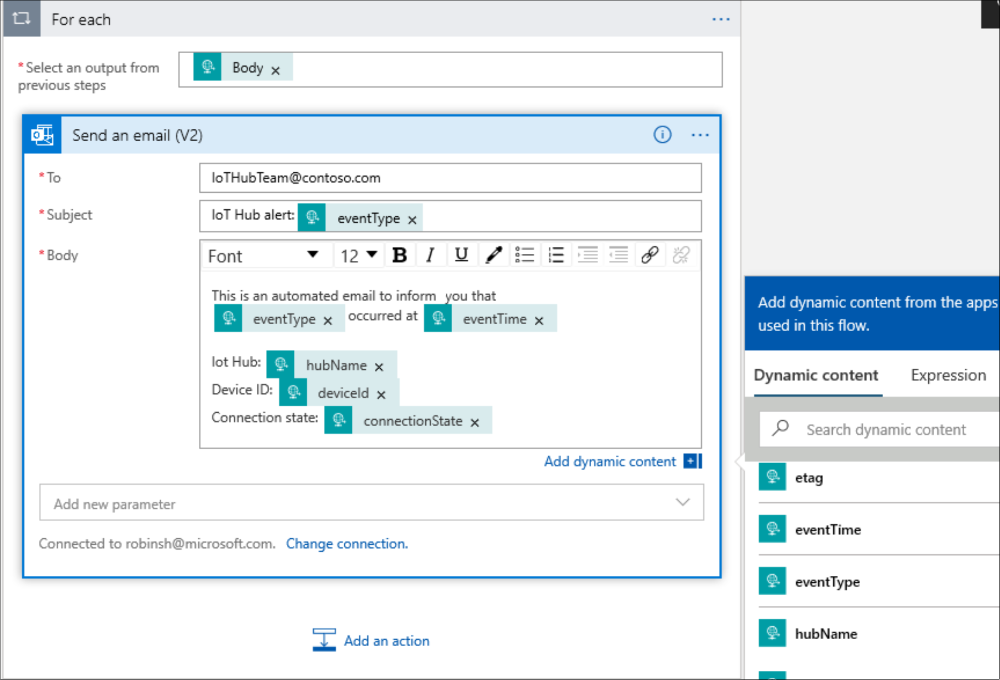
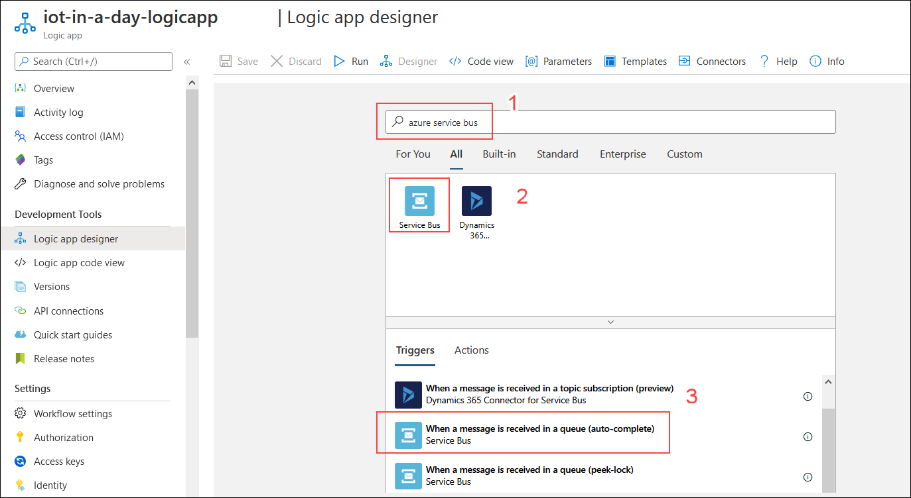
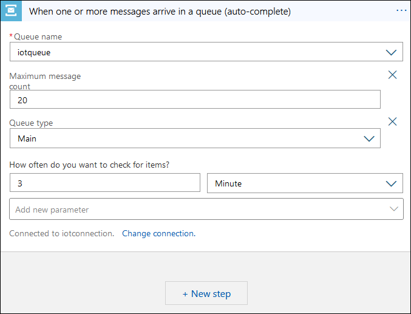

# Azure IoT Hub and Azure ML 

## Lab Scenario

Insights generated so far require manual involvement to detect anomalies. Can you make use of automated techniques to detect anomalies?

Up-on anomaly detection, can you escalate the issue asap?

Two weeks after launching the new system it has revealed a temperature spike in-transit for a specific shipment. Some of the cheese in the shipment was ruined, but the new system did ensure that the affected cheese wasn't delivered to the customer. Since you know the Azure IoT side of the monitoring system better than anyone, you will lead the investigation.

Management has asked you to determine if the system can be improved, hopefully to the point where it will prevent the loss of product in the future. You correlate the IoT devices' sensor data taken from the trucks and planes used during the shipment. It appears that the temperature in one of the trucks rose unexpectedly in a particular area of the vehicle and created the heat spike in one of the transport containers (which was equipped with an IoT device monitoring temperature and humidity).

Your team decides that further improvements to the monitoring system will require near real-time data exploration and root-cause analysis.

You propose adding Time Series Insights to the Azure IoT solution. This will enable Fabrikam, Inc. to quickly store, visualize, and query the large amounts of time series data that are generated by the IoT devices in the trucks, planes, and containers, and to visualize changes over time. 

### Exercise 1: Run Simulated IoT Devices

**Built-in Machine Learning Model** - The AnomalyDetection_SpikeAndDip function uses a sliding window to analyze data for anomalies. The sliding window could be, for example, the most recent two minutes of telemetry data. The window advances in near real-time with the flow of telemetry. If the size of the sliding window is increased to include more data, the accuracy of anomaly detection will increase as well (however, the latency also increases, so a balance must be found).

#### Task 1: Triggering anaomalies using IoT Simulator App

1. From the IoT simulator app dialog , Click on **Anamoly** which is next to stop telemetry that sends anamolies to IoT hub.

    >**Note**: If the devices are not sending telemetry , make sure to start IoT Simulator App and simulate the devices.
    
1. On the grid, list of telemetry messages that are transmitted are displayed.Observe the simulated temperature value.

#### Task 2: Update the SQL query for the Job

1. On the resource group tile, click **iot-{deployment-id}** and select the stream analytics job named **iotstreamjob-{deployment-id}**.

1. On the left-side menu under **Job topology**, click **Query**.

1. Copy the following SQL query, and then replace it with the existing query.

    ```sql
     WITH AnomalyDetectionStep AS
     (
       SELECT
           time AS time,
           CAST(temp AS float) AS temp,
           AnomalyDetection_SpikeAndDip(CAST(temp AS float), 95, 120, 'spikesanddips')
               OVER(LIMIT DURATION(second, 120)) AS SpikeAndDipScores
       FROM inputjobtemp
    )
       SELECT
           time,
           temp,
           CAST(GetRecordPropertyValue(SpikeAndDipScores, 'Score') AS float) AS
           SpikeAndDipScore,
           CAST(GetRecordPropertyValue(SpikeAndDipScores, 'IsAnomaly') AS bigint) AS
           IsSpikeAndDipAnomaly
      INTO powerbioutput
      FROM AnomalyDetectionStep
    ```

    > **Note**:  This first section of this query takes the temperature data, and examines the previous 120 seconds worth. The `AnomalyDetection_SpikeAndDip` function will return a `Score` parameter, and an `IsAnomaly` parameter. The score is how certain the ML model is that the given value is an anomaly, specified as a percentage. If the score exceeds 95%, the `IsAnomaly` parameter has a value of 1, otherwise `IsAnomaly` has a value of 0. Notice the 120 and 95 parameters in the first section of the query. The second section of the query sends the time, temperature, and anomaly parameters to `powerbioutput`.

1. Verify that the query editor now lists 1 Input and 2 Outputs:

    * `Inputs`
      * `inputjobtemp`
    * `Outputs`
      * `outputjobtemp`
      * `powerbioutput`      

    If you see more than 1 of each then you likely have a typo in your query or in the name you used for the input or output - correct the issue before moving on.

1. To save the query, click **Save query**.

1. On the left-side menu, click **Overview**.

1. Near the top of the blade, click **Start**.

1. On the **Start job** pane, under **Job output start time**, ensure **Now** is selected, and then click **Start**.

In order for a human operator to easily interpret the output from this query, you need to visualize the data in a friendly way. One way of doing this visualization is to create a Power BI dashboard.

### Exercise 2: Create a Power BI Dashboard

Now for the final part of the scenario - the actual data visualization. You have updated your job to process the telemetry via the ML model and output the results to Power BI. Within Power BI, you need to create a dashboard with a number of tiles to visualize the results and provide decision support for the operator.

#### Task 1: Create a New Dashboard

1. In your browser, navigate again to [https://app.powerbi.com/](https://app.powerbi.com/).

1. Once Power BI has opened, on the left-side navigation menu, expand **Workspaces**, and then select the **My workspace**.

    > **Note**:  At the time of writing, Power BI has a *New Look* in preview. The steps in this task have been written assuming the *New Look* is **Off**. To turn off the *New Look*, on the toolbar at the top of the screen, ensure that the toggle reads **New look off**. 

1. On the **Datasets** tab, verify that **temperaturedataset** is displayed.

    If not, you might have to wait a short time for this list to populate.

1. At the top right of the page, click **+ Create**, and then click **Dashboard**.

1. In the **Create dashboard** popup, under **Dashboard name**, type **Temperature Dash** and then click **Create**.

    The new dashboard will be displayed as an essentially blank page.

#### Task 2: Add the Temperature Gauge Tile

1. To add a vibration gauge, at the top of the blank dashboard, click **+ Add tile**.

1. In the **Add tile** pane, under **REAL-TIME DATA**, click **Custom Streaming Data**, and then click **Next**.

1. On the **Add a custom streaming data tile** pane, under **YOUR DATASETS**, click **temperaturedataset**, and then click **Next**.

    The pane will refresh to allow you to choose a visualization type and fields.

1. Under **Visualization Type**, open the dropdown, and then click **Gauge**.

    Notice that changing the visualization type changes the fields below.

1. Under **Values**, click **+ Add value**, open the dropdown, and then click **temp**.

    Notice that the gauge appears immediately on the dashboard with a value that begins to update!

1. To display the Tile details pane, click **Next**.

1. In the **Tile details** pane, under **Title**, enter **Temperature**.

1. To leave the remaining fields at default values and close the pane, click **Apply**.

    If you see a notification about creating a phone view, you can ignore it and it will disappear shortly (or dismiss it yourself).

1. To reduce the size of the tile, hover your mouse over the bottom-right corner of the tile, and then click-and-drag the resize mouse pointer.

    Make the tile as small as you can. It will snap to various preset sizes.

#### Task 3: Add the SpikeAndDipScore Clustered Bar Chart Tile

1. To add the SpikeAndDipScore Clustered Bar Chart, at the top of the dashboard, click **+ Add tile**.

1. In the **Add tile** pane, under **REAL-TIME DATA**, click **Custom Streaming Data**, and then click **Next**.

1. On the **Add a custom streaming data tile** pane, under **YOUR DATASETS**, click **temperaturedataset**, and then click **Next**.

1. Under **Visualization Type**, open the dropdown, and then click **Clustered bar chart**.

    Notice that changing the visualization type changes the fields below.

1. Under **Values**, click **+ Add value**, open the dropdown, and then click **SpikeAndDipScore**.

1. To display the Tile details pane, click **Next**.

1. To close Tile details pane, click **Apply**.

    If you see a notification about creating a phone view, you can ignore it and it will disappear shortly (or dismiss it yourself).

1. Again, reduce the size of the tile, making it as small as you can.

#### Task 4: Add the IsSpikeAndDipAnomaly Card Tile

1. At the top of the dashboard, to add a IsSpikeAndDipAnomaly Card visualization, click **+ Add tile**.

1. In the **Add tile** pane, under **REAL-TIME DATA**, click **Custom Streaming Data**, and then click **Next**.

1. On the **Add a custom streaming data tile** pane, under **YOUR DATASETS**, click **temperaturedataset**, and then click **Next**.

1. Under **Visualization Type**, open the dropdown, and then click **Card**.

1. Under **Fields**, click **+ Add value**, open the dropdown, and then click **IsSpikeAndDipAnomaly**.

1. To display the Tile details pane, click **Next**.

1. In the **Tile details** pane, under **Title**, enter **Is Anomaly?**

1. To close the Tile details pane, click **Apply**.

    If you see a notification about creating a phone view, you can ignore it and it will disappear shortly (or dismiss it yourself).

1. Again, reduce the size of the tile, making it as small as you can.

#### Task 5: Rearrange the Tiles

1. Using drag-and-drop, arrange the tiles vertically on the left of the dashboard in the following order:

    * SpikeAndDipScore
    * Is Anomaly?
    * Temperature

#### Task 6: Add Anomalies Over The Hour Line Chart Tile

Now to create a fourth tile, the `Anomalies Over the Hour` line chart.  This one is a bit more complex.

1. At the top of the dashboard, click **+ Add tile**.

1. In the **Add tile** pane, under **REAL-TIME DATA**, click **Custom Streaming Data**, and then click **Next**.

1. On the **Add a custom streaming data tile** pane, under **YOUR DATASETS**, click **temperaturedataset**, and then click **Next**.

    The pane will refresh to allow you to choose a visualization type and fields.

1. Under **Visualization Type**, open the dropdown, and then click **Clustered bar chart**.

    Notice that changing the visualization type changes the fields below.

1. Under **Axis**, click **+ Add value**, and then select **time** from the dropdown.

1. Under **Values**, click **+ Add value**, and then select **IsSpikeAndDipAnomaly** from the dropdown.

    Notice that the chart appears immediately on the dashboard with a value that begins to update!

1. Under **Time window to display**, to the right of **Last**, open the dropdown, and then click **60**

    Leave the units set to **Minutes**.

1. To display the Tile details pane, click **Next**.

1. In the **Tile details** pane, under **Title**, enter **Anomalies over the hour**.

1. To close the Tile details pane, click **Apply**.

    If you see a notification about creating a phone view, you can ignore it and it will disappear shortly (or dismiss it yourself).

1. This time, stretch the tile so its height matches the 3 tiles to the left and its width fits the remaining space of the dashboard.

    There is a latency with so many routes and connections, but you should start seeing the vibration data in the visualizations

    > **Note**:  If no data appears, check you are running the device app and the analytics job is running.

    Let the job run for a while, several minutes at least before the ML model will kick in. Compare the console output of the device app, with the Power BI dashboard. Are you able to correlate the forced and increasing vibrations to a run of anomaly detections?

If you're seeing an active Power BI dashboard, you've just completed this lab. Great work.

### Exercise 3: Integrate with Logic App

#### Task 1: Configure Your Logic App 

1. On your resource group tile, select the Logic App named **iot-in-a-day-logicapp{deployment-id}**.

    > **Note**: When navigating to the **Logic App** for the first time, the **Logic Apps Designer** pane will be displayed. If this page doesn't come up automatically, click **Logic app designer** under the **Development Tools** section on the **Logic App** blade.

1. Under the **Start with a common trigger** section, click **When a HTTP request is received**.

    Starting out with one of the commonly used triggers is a convenient way to get started on your Logic App.

1. Notice that the visual designer opens with the **When a HTTP request is received** trigger selected.

1. On the **When a HTTP request is received** trigger, under the **Request Body JSON Schema** textbox, click the **Use sample payload to generate schema** link.

    > **Note**: In the next step you will be adding the **DeviceCreated** sample event schema to the Request Body JSON Schema textbox. This sample, along with a couple of other event schema samples and some associated documentation, can be found at the following link for those who want to learn more: [Azure Event Grid event schema for IoT Hub](https://docs.microsoft.com/en-us/azure/event-grid/event-schema-iot-hub).

1. Use a copy-and-paste operation to add the following sample JSON to the Request Body JSON Schema textbox, and then click **Done**.

    ```json
    [{
      "id": "56afc886-767b-d359-d59e-0da7877166b2",
      "topic": "/SUBSCRIPTIONS/<subscription ID>/RESOURCEGROUPS/<resource group name>/PROVIDERS/MICROSOFT.DEVICES/IOTHUBS/<hub name>",
      "subject": "devices/LogicAppTestDevice",
      "eventType": "Microsoft.Devices.DeviceCreated",
      "eventTime": "2018-01-02T19:17:44.4383997Z",
      "data": {
        "twin": {
          "deviceId": "LogicAppTestDevice",
          "etag": "AAAAAAAAAAE=",
          "deviceEtag": "null",
          "status": "enabled",
          "statusUpdateTime": "0001-01-01T00:00:00",
          "connectionState": "Disconnected",
          "lastActivityTime": "0001-01-01T00:00:00",
          "cloudToDeviceMessageCount": 0,
          "authenticationType": "sas",
          "x509Thumbprint": {
            "primaryThumbprint": null,
            "secondaryThumbprint": null
          },
          "version": 2,
          "properties": {
            "desired": {
              "$metadata": {
                "$lastUpdated": "2018-01-02T19:17:44.4383997Z"
              },
              "$version": 1
            },
            "reported": {
              "$metadata": {
                "$lastUpdated": "2018-01-02T19:17:44.4383997Z"
              },
              "$version": 1
            }
          }
        },
        "hubName": "egtesthub1",
        "deviceId": "LogicAppTestDevice"
      },
      "dataVersion": "1",
      "metadataVersion": "1"
    }]
    ```

    This sample JSON is an example of the JSON that Event Grid will POST to the Web Hook endpoint for the Logic App once it's created. This sample includes the IoT Hub Message Telemetry properties for the IoT Device that will be sending telemetry messages.

1. Notice that the **Request Body JSON Schema** textbox is now populated with a JSON schema that was automatically generated based on the sample JSON that you provided.

1. Below the **When a HTTP request is received** trigger, click **+ New step**.

1. Below **Choose an action**, in the search textbox, enter **Outlook.com**

1. In the list of Actions, scroll down to the Send options, and then click **Send an email (V2)**.

    > **Note**:  These instructions walk through configuring the Logic App to send an email using an **Outlook.com** email address. Alternatively, the Logic App can also be configured to send email using the Office 365 Outlook or Gmail connectors as well.

1. On the **Outlook.com** connector, click **Sign in**, and then follow the prompts to authenticate with an existing Outlook.com account.

1. If prompted to **Let this app access your info**, click **Yes**.

1. On the **Send an email (V2)** action, in the **To** field, enter an email address to send email messages to.

    For the purposes of this lab, you will provide an email address where you can receive the email notification. You can enter the Outlook.com account used for this connector, or another email account that is easy for you to access.

    The Outlook.com account that was authenticated in the step above will be used to send the emails.

1. In the **Subject** field, enter **IoT Hub alert:**

1. In the **Body** field, enter the following message content:

    ```text
    This is an automated email to inform you that:

    {eventType} occurred at {eventTime}

    IoT Hub: {hubName}
    Device ID: {deviceID}
    Connection state: {connectionState}
    ```

1. Take a moment to examine the message body that you just entered.

    You may have realized that the curly-braces entries are intended to represent dynamic content. You will need to replace these placeholder entries with the actual Dynamic content values.

    > **Note**: If the Add dynamic content tools are not displayed to the right of the connector, click the **Add dynamic content** hyperlink located directly under the **Body** text box. If it doesn't list the fields you need, click **See more** in the Dynamic content pane to include the fields included in the message body that you entered.

    In the next step you will replace each placeholder value with the corresponding Dynamic content value.

1. For each dynamic content placeholder, delete the entry and then replace it with the corresponding Dynamic content field.

    When you add the first dynamic content value, because the input data schema is for an array, the Logic Apps Designer will automatically change the e-mail action to be nested inside of a **For each** action. When this happens, the **Send an email (V2)** action will collapse. To reopen your email message, click **Send an email (V2)**, and then continue editing the message body.

    When you have completed this step you should see a message body that is similar to the following:

    

1. Once the logic app is configured properly, you will recieve an email.

### Extra Credits - Adding Service Bus Trigger

When you add a trigger or action that connects to a service or system for the first time, the **Logic App Designer** prompts you to create a connection by providing the necessary information, which varies based on the connection.

1. Sign in to the **Azure portal**, and open your blank logic app in the **Logic App Designer**.

1. Select **Blank Logic App +** tile from Logic app designer pane .

1. In the search box, enter **"azure service bus"** as your filter. From the triggers list, select the trigger that you want.

1. For example, to trigger your *logic app* when a new item gets sent to a Service Bus queue, select the **When a message is received in a queue (auto-complete) trigger**.

   

   When one or more messages arrive in a queue (auto-complete) trigger, can return one or more messages. When these triggers fire, they return between one and the number of messages that's specified by the trigger's Maximum message count property.
   
1. If your trigger is connecting to your Service Bus namespace for the first time, follow these steps when the Logic App Designer prompts you for connection information.

   * Provide a name for your connection, for example like **iotservicebusconnection**.
   * Select your **Service Bus namespace**.
   * Select your Service Bus policy, and select **Create**.

1. Select the messaging entity you want, such as a **queue** or topic
   
    
    
1. Provide the necessary information for your selected trigger. To add other available properties to the action, open the Add new parameter list, and select the properties that you want. For example, select the polling interval and frequency for checking the queue.

Continue building your logic app by adding the actions that you want. For example, you can add an action that sends email when a new message arrives. When your trigger checks your queue and finds a new message, your logic app runs your selected actions for the found message.

1. Under the step where you want to add an action, select **+ New step**.

1. In the search box, enter **Office 365 Outlook** as your filter and select **Send an email (V2)**

1. On the **Outlook.com** connector, click **Sign In**, and then follow the prompts to authenticate with an existing Outlook.com account.

1. If prompted to **Let this app access your info**, click **Yes**.

1. On the Send an email (V2) action, in the To field, enter an email address to send email messages to and congigure further accordingly.

1. Once its configured properly, you will receive an email.
