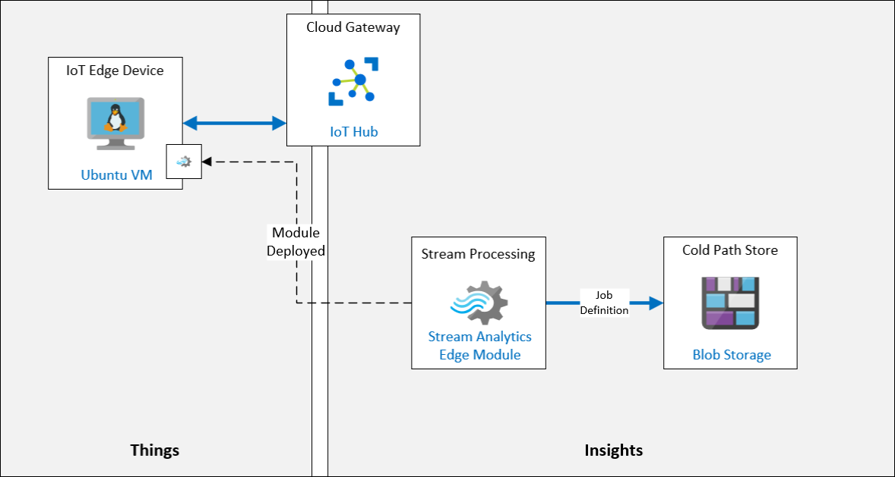

# Introduction to Azure IoT Edge

## Lab Scenario

With huge number of deployments of devices, large amount of data is being collected and send to cloud. Is it possible to bring intelligence to the Edge?

Each location supports multiple production lines that are equipped with the mixing and processing machines that are used to create the local cheeses. Currently, the facilities have IoT devices connected to each machine. These devices stream sensor data to Azure and all data is processed in the cloud. 

Due to the large amount of data being collected and the urgent time response needed on some of the machines, Fabrikam, Inc. wants to use an IoT Edge gateway device to bring some of the intelligence to the edge for immediate processing. A portion of the data will still be sent to the cloud. Bringing data intelligence to the IoT Edge also ensures that they will be able to process data and react quickly even if the local network is poor.

You have been tasked with prototyping the Azure IoT Edge solution. To begin, you will be setting up an IoT Edge device that monitors temperature (simulating a device connected to one of the cheese processing machines). You will then deploy a Stream Analytics module to the device that will be used to calculate the average temperature and generate an alert notification if process control values are exceeded.

The following resources will be created:



## In This Lab

In this lab, you will complete the following activities:

* Create an IoT Edge Device Identity in IoT Hub using Azure CLI
* Connect the IoT Edge Device to IoT Hub
* Add an Edge Module to the Edge Device
* Deploy Azure Stream Analytics as an IoT Edge Module

### Exercise 1: Create an IoT Edge Device Identity in IoT Hub using Azure CLI

In this exercise, you will create a new IoT Edge Device Identity within Azure IoT Hub using the Azure CLI.

1. If necessary, log in to your Azure portal using your Azure account credentials.

    If you have more than one Azure account, be sure that you are logged in with the account that is tied to the subscription that you will be using for this course.

1. On the Azure portal toolbar, to open the Azure Cloud Shell, click **Cloud Shell**.

    On the Azure portal toolbar, not the left side navigation menu, the Cloud Shell button has an icon that looks similar ot a command prompt.

1. Ensure that you are using the **Bash** environment option.

    In the upper left corner of the Cloud Shell, Bash should be selected in the environment dropdown.

1. At the command prompt, to create an IoT Edge device identity in your IoT hub, enter the following command:

    ```cmd/sh
    az iot hub device-identity create --hub-name iot-in-a-day-hub-{your-id} --device-id sensor-th-0067 --edge-enabled
    ```

    Be sure to replace the `{your-id}` placeholder with the YOUR-ID value that you created at the start of this course.

    > **Note**: You could also create this IoT Edge device using your IoT Hub in the Azure portal: **IoT Hub** -> **IoT Edge** -> **Add an IoT Edge device**.

1. Review the output that the command created. 

    Notice that the output contains information about the **Device Identity** that was created for the IoT Edge device. For example, you can see it defaults to `symmetricKey` authentication with auto-generated keys, and the `iotEdge` capability is set to `true` as indicated by the `--edge-enabled` parameter that was specified.

    ```json
    {
        "authentication": {
            "symmetricKey": {
                "primaryKey": "jftBfeefPsXgrd87UcotVKJ88kBl5Zjk1oWmMwwxlME=",
                "secondaryKey": "vbegAag/mTJReQjNvuEM9HEe1zpGPnGI2j6DJ7nECxo="
            },
            "type": "sas",
            "x509Thumbprint": {
                "primaryThumbprint": null,
                "secondaryThumbprint": null
            }
        },
        "capabilities": {
            "iotEdge": true
        },
        "cloudToDeviceMessageCount": 0,
        "connectionState": "Disconnected",
        "connectionStateUpdatedTime": "0001-01-01T00:00:00",
        "deviceId": "sensor-th-0067",
        "deviceScope": "ms-azure-iot-edge://sensor-th-0067-637093398936580016",
        "etag": "OTg0MjI1NzE1",
        "generationId": "637093398936580016",
        "lastActivityTime": "0001-01-01T00:00:00",
        "status": "enabled",
        "statusReason": null,
        "statusUpdatedTime": "0001-01-01T00:00:00"
    }
    ```

1. To display the **Connection String** for your IoT Edge device, enter the following command:

    ```cmd/sh
    az iot hub device-identity show-connection-string --device-id sensor-th-0067 --hub-name iot-in-a-day-hub-{your-id}
    ```

    > **Note**: Be sure to replace the `{your-id}` with **Deployment ID**. You can obtain the **Deployment ID** from the Environment Details Tab.

1. Copy the value of the `connectionString` from the JSON output of the command, and then save it for reference later.

    This connection string will be used to configure the IoT Edge device to connect to IoT Hub.

    ```json
        {
          "connectionString": "HostName={IoTHubName}.azure-devices.net;DeviceId=sensor-th-0067;SharedAccessKey=jftBfeefPsXgrd87UcotVKJ88kBl5Zjk1oWmMwwxlME="
        }
    ```

    > **Note**:  The IoT Edge Device Connection String can also be accessed within the Azure Portal, by navigating to **IoT Hub** -> **IoT Edge** -> **Your Edge Device** -> **Connection String (primary key)**

### Exercise 2: Connect IoT Edge Device to IoT Hub

**Azure IoT Edge** - Azure IoT Edge moves cloud analytics and custom business logic to devices so that your organization can focus on business insights instead of data management.

In this exercise, you will connect the IoT Edge Device to Azure IoT Hub.

1. On the Azure portal menu, click **Resource groups**.
 
1. From **iot-{deployment-id}** resource group, click the IoT Edge virtual machine **vm-iot-edge-{deployment-id}**.

1. At the top of the **Overview** pane, click **Connect**, and then click **SSH**.

1. On the **Connect** pane, under **4. Run the example command below to connect to your VM**, copy the example command.

    This is a sample SSH command that can be used to connect to the virtual machine that contains the IP Address for the VM and the Administrator username. The command should be formatted similar to `ssh username@52.170.205.79`.

    > **Note**: If the sample command includes `-i <private key path>`, use a text editor to remove that portion of the command, and then copy the updated command into the clipboard.

1. If Cloud Shell is not still open, click **Cloud Shell**.

1. At the Cloud Shell command prompt, paste the `ssh` command that you updated in the text editor, and then press **Enter**.

1. When prompted with **Are you sure you want to continue connecting?**, type `yes` and then press **Enter**.

    This prompt is a security confirmation since the certificate used to secure the connection to the VM is self-signed. The answer to this prompt will be remembered for subsequent connections, and is only prompted on the first connection.

1. When prompted to enter the password, enter **Password.1!!** and press **Enter**.

1. Once connected, the terminal command prompt will change to show the name of the Linux VM, similar to the following.

    ```cmd/sh
    demouser@vm-iot-edge-{your-id}:~$
    ```

    This tells you which VM you are connected to.

    > **Important:** When you connect, you will likely be told there are outstanding OS updates for the Edge VM.  We are ignoring this for our lab purposes, but in production, you always want to be sure to keep your Edge devices up-to-date.

1. To confirm that the Azure IoT Edge Runtime is installed on the VM, run the following command:

    ```cmd/sh
    iotedge version
    ```

    This command outputs the version of the Azure IoT Edge Runtime that is currently installed on the virtual machine.

1. To configure the Edge device with the device connection string for Azure IoT Hub, enter the following command:

    ```cmd/sh
    sudo /etc/iotedge/configedge.sh "{iot-edge-device-connection-string}"
    ```

    Be sure to replace the `{iot-edge-device-connection-string}` placeholder above with the Connection String value that you made a record of when you created your IoT Edge Device (and make sure you include the quotation marks on the command line).

    The `/etc/iotedge/configedge.sh` script is used to configure the Edge device with the Connection String necessary to connect it to Azure IoT Hub. This script is installed as part of the Azure IoT Edge Runtime.

1. Verify that the connection string has been set.

    Once this command completes, the IoT Edge Device will be configured to connect to Azure IoT Hub using the connection string that was entered. The command will output a `Connection string set to ...` message that includes the Connection String that was set.

### Exercise 2: Add Edge Module to Edge Device

In this exercise, you will add a Simulated Temperature Sensor as a custom IoT Edge Module, and deploy it to run on the IoT Edge Device.

1. If necessary, log in to your Azure portal using your Azure account credentials.

    If you have more than one Azure account, be sure that you are logged in with the account that is tied to the subscription that you will be using for this course.

1. On your Resource group tile, to open your IoT Hub, click **iot-in-a-day-hub-{your-id}**.

1. At the left of the **IoT Hub** blade, under **Automatic Device Management**, click **IoT Edge**.

1. On the list of IoT Edge Devices, click **sensor-th-0067**.

1. On the **sensor-th-0067** blade, notice that the **Modules** tab displays a list of the modules currently configured for the device.

    Currently, the IoT Edge device is configured with only the Edge Agent (`$edgeAgent`) and Edge Hub (`$edgeHub`) modules that are part of the IoT Edge Runtime.

1. At the top of the **sensor-th-0067** blade, click **Set Modules**.

1. On the **Set modules on device: sensor-th-0067** blade, locate the **IoT Edge Modules** section.

1. Under **IoT Edge Modules**, click **Add**, and then click **IoT Edge Module**.

1. On the **Add IoT Edge Module** pane, under **IOT Edge Module Name**, enter **tempsensor**

    We will be naming our custom module "tempsensor"

1. Under **Image URI**, enter **asaedgedockerhubtest/asa-edge-test-module:simulated-temperature-sensor**

    > **Note**: This image is a published image on Docker Hub that is provided by the product group to support this testing scenario.

1. To change the selected tab, click **Module Twin Settings**.

1. To specify the desired properties for the module twin, enter the following JSON:

    ```json
    {
        "EnableProtobufSerializer": false,
        "EventGeneratingSettings": {
            "IntervalMilliSec": 500,
            "PercentageChange": 2,
            "SpikeFactor": 2,
            "StartValue": 20,
            "SpikeFrequency": 20
        }
    }
    ```

    This JSON configures the Edge Module by setting the desired properties of its module twin.

1. At the bottom of the blade, click **Add**.

1. On the **Set modules on device: sensor-th-0067** blade, at the bottom of the blade, click **Next: Routes >**.

1. Notice that a default route is already configured.

    * Name: **route**
    * Value: `FROM /messages/* INTO $upstream`

    This route will send all messages from all modules on the IoT Edge Device to IoT Hub

1. Click **Review + create**.

1. Click **Create**.

1. Under **Deployment**, take a minute to review the deployment manifest that is displayed. 

    As you can see, the Deployment Manifest for the IoT Edge Device is formatted as JSON, which makes it pretty easy to read.

    Under the `properties.desired` section is the `modules` section that declares the IoT Edge Modules that will be deployed to the IoT Edge Device. This includes the Image URIs of all the modules, including any container registry credentials.

    ```json
    {
        "modulesContent": {
            "$edgeAgent": {
                "properties.desired": {
                    "modules": {
                        "tempsensor": {
                            "settings": {
                                "image": "asaedgedockerhubtest/asa-edge-test-module:simulated-temperature-sensor",
                                "createOptions": ""
                            },
                            "type": "docker",
                            "version": "1.0",
                            "status": "running",
                            "restartPolicy": "always"
                        },
    ```

    Lower in the JSON is the **$edgeHub** section that contains the desired properties for the Edge Hub. This section also includes the routing configuration for routing events between modules, and to IoT Hub.

    ```json
        "$edgeHub": {
            "properties.desired": {
                "routes": {
                  "route": "FROM /messages/* INTO $upstream"
                },
                "schemaVersion": "1.0",
                "storeAndForwardConfiguration": {
                    "timeToLiveSecs": 7200
                }
            }
        },
    ```

    Lower still in the JSON is a section for the **tempsensor** module, where the `properties.desired` section contains the desired properties for the configuration of the edge module.

    ```json
                },
                "tempsensor": {
                    "properties.desired": {
                        "EnableProtobufSerializer": false,
                        "EventGeneratingSettings": {
                            "IntervalMilliSec": 500,
                            "PercentageChange": 2,
                            "SpikeFactor": 2,
                            "StartValue": 20,
                            "SpikeFrequency": 20
                        }
                    }
                }
            }
        }
    ```

1. At the bottom of the blade, to finish setting the modules for the device, click **Create**.

1. On the **sensor-th-0067** blade, under **Modules**, notice that **tempsensor** is now listed.

    > **Note**: You may have to click **Refresh** to see the module listed for the first time.

    You may notice that the RUNTIME STATUS for **tempsensor** is not reported.

1. At the top of the blade, click **Refresh**.

1. Notice that the **RUNTIME STATUS** for the **tempsensor** module is now set to **running**.

    If the value is still not reported, wait a moment and refresh the blade again.
 
1. Open a Cloud Shell session (if it is not still open).

    If you are no longer connected to the `vm-iot-edge-{your-id}` virtual machine, connect using **SSH** as before.

1. At the Cloud Shell command prompt, to list the modules currently running on the IoT Edge Device, enter the following command:

    ```cmd/sh
    iotedge list
    ```

1. The output of the command look similar to the following. 

    ```cmd/sh
    demouser@vm-iot-edge-{your-id}:~$ iotedge list
    NAME             STATUS           DESCRIPTION      CONFIG
    edgeHub          running          Up a minute      mcr.microsoft.com/azureiotedge-hub:1.0
    edgeAgent        running          Up 26 minutes    mcr.microsoft.com/azureiotedge-agent:1.0
    tempsensor       running          Up 34 seconds    asaedgedockerhubtest/asa-edge-test-module:simulated-temperature-sensor
    ```

    Notice that `tempsensor` is listed as one of the running modules.

1. To view the module logs, enter the following command:

    ```cmd/sh
    iotedge logs tempsensor
    ```

    The output of the command looks similar to the following:

    ```cmd/sh
     demouser@vm-iot-edge-{your-id}:~$ iotedge logs tempsensor
    11/14/2019 18:05:02 - Send Json Event : {"machine":{"temperature":41.199999999999925,"pressure":1.0182182583425192},"ambient":{"temperature":21.460937846433808,"humidity":25},"timeCreated":"2019-11-14T18:05:02.8765526Z"}
    11/14/2019 18:05:03 - Send Json Event : {"machine":{"temperature":41.599999999999923,"pressure":1.0185790159334602},"ambient":{"temperature":20.51992724976499,"humidity":26},"timeCreated":"2019-11-14T18:05:03.3789786Z"}
    11/14/2019 18:05:03 - Send Json Event : {"machine":{"temperature":41.999999999999922,"pressure":1.0189397735244012},"ambient":{"temperature":20.715225311096397,"humidity":26},"timeCreated":"2019-11-14T18:05:03.8811372Z"}
    ```

    The `iotedge logs` command can be used to view the module logs for any of the Edge modules.

1. The Simulated Temperature Sensor Module will stop after it sends 500 messages. It can be restarted by running the following command:

    ```cmd/sh
    iotedge restart tempsensor
    ```

    You do not need to restart the module now, but if you find it stops sending telemetry later, then go back into Cloud Shell, SSH to your Edge VM, and run this command to reset it. Once reset, the module will start sending telemetry again.

### Exercise 3: Deploy Azure Stream Analytics as IoT Edge Module

Now that the tempSensor module is deployed and running on the IoT Edge device, we can add a Stream Analytics module that can process messages on the IoT Edge device before sending them on to the IoT Hub.

#### Task 1: Configure Azure Stream Analytics Job

1. On the resource group tile, click **iot-{deployment-id}** and select the stream analytics job named **iotedgejob-{deployment-id}**.

    You should now be on the Overview pane of your new Stream Analytics job.
 
1. On the left side navigation menu, under **Job topology**, click **Inputs**.

1. On the **Inputs** pane, click **Add stream input**, and then click **Edge Hub**.

1. On the **Edge Hub** pane, in the **Input alias** field, enter **temperature**

1. In the **Event serialization format** dropdown, ensure that **JSON** is selected. 

    Stream Analytics needs to understand the message format. JSON is the standard format.

1. In the **Encoding** dropdown, ensure that **UTF-8** is selected.

    > **Note**:  UTF-8 is the only JSON encoding supported at the time of writing.

1. In the **Event compression type** dropdown, ensure that **None** is selected.

    For this lab, compression will not be used. GZip and Deflate formats are also supported by the service.

1. At the bottom of the pane, click **Save**.

1. On the left side navigation menu, under **Job topology**, click **Outputs**.

1. On the **Outputs** pane, click **+ Add**, and then click **Edge Hub**.

1. On the **Edge Hub** pane, in the **Output alias** field, enter **alert**

1. In the **Event serialization format** dropdown, ensure that **JSON** is selected.

    Stream Analytics needs to understand the message format. JSON is the standard format, but CSV is also supported by the service.

1. In the **Format** dropdown, ensure that **Line separated** is selected.

1. In the **Encoding** dropdown, ensure that **UTF-8** is selected.

    > **Note**:  UTF-8 is the only JSON encoding supported at the time of writing.

1. At the bottom of the pane, click **Save**.

1. On the left side navigation menu, under **Job topology**, click **Query**.

1. In the **Query** pane, replace the Default query with the following:

    ```sql
    SELECT  
        'reset' AS command
    INTO
        alert
    FROM
        temperature TIMESTAMP BY timeCreated
    GROUP BY TumblingWindow(second,15)
    HAVING Avg(machine.temperature) > 25
    ```

    This query looks at the events coming into the `temperature` Input, and groups by a Tumbling Windows of 15 seconds, then it checks if the average temperature value within that grouping is greater than 25. If the average is greater than 25, then it sends an event with the `command` property set to the value of `reset` to the `alert` Output.

    For more information about the `TumblingWindow` functions, reference this link: [https://docs.microsoft.com/en-us/stream-analytics-query/tumbling-window-azure-stream-analytics](https://docs.microsoft.com/en-us/stream-analytics-query/tumbling-window-azure-stream-analytics)

1. At the top of the query editor, click **Save query**.

#### Task 2: Configure Storage Account Settings

To prepare the Stream Analytics job to be deployed to an IoT Edge Device, it needs to be associated with an Azure Blob Storage container. When the job is deployed, the job definition is exported to the storage container.

1. On the **Stream Analytics job** blade, on the left side navigation menu under **Configure**, click **Storage account settings**.

1. On the **Storage account settings** pane, click **Add storage account**.

1. Under **Storage account settings**, ensure that **Select storage account from your subscriptions** is selected.

1. In the **Storage account** dropdown, ensure that the **iotstorage{your-id}** storage account is selected.

1. Under **Container**, click **Create new**, and then enter **jobdefinition** as the name of the container.

1. At the top of the pane, click **Save**.

    If prompted to confirm that you want to save the changes, click **Yes**

#### Task 3: Deploy the Stream Analytics Job

1. In the Azure portal, navigate to your **iot-in-a-day-hub-{your-id}** IoT Hub resource.

1. On the left side navigation menu, under **Automatic Device Management**, click **IoT Edge**.

1. Under **Device ID**, click **sensor*.

1. At the top of the **sensor-th-0067** pane, click **Set Modules**.

1. On the **Set modules on device: sensor-th-0067** pane, locate the **IoT Edge Modules** section.

1. Under **IoT Edge Modules**, click **Add**, and then click **Azure Stream Analytics Module**.

1. On the **Edge deployment** pane, under **Subscription**, ensure that the subscription you are using for this course is selected.

1. In the **Edge job** dropdown, ensure that the **iot-{deployment-id}** Steam Analytics job is selected.

    > **Note**:  The job may already be selected, yet the **Save** button is disabled - just open the **Edge job** dropdown again and select the **iotedgejob-{deployment-id}** job again. The **Save** button should then become enabled.

1. At the bottom of the pane, click **Save**.

    Deployment may take a few moments.

1. Once the Edge package has been successfully published, notice that the new ASA module is listed under the **IoT Edge Modules** section

1. Under **IoT Edge Modules**, click **iotedgejob-{deployment-id}**.. 

    This is the Steam Analytics module that was just added to your Edge device.

1. On the **Update IoT Edge Module** pane, notice that the **Image URI** points to a standard Azure Stream Analytics image.

    ```text
    mcr.microsoft.com/azure-stream-analytics/azureiotedge:1.0.7
    ```

    This is the same image used for every ASA job that gets deployed to an IoT Edge Device.

    > **Note**:  The version number at the end of the **Image URI** that is configured will reflect the current latest version when you created the Stream Analytics Module.

1. Leave all values as their defaults, and close the **IoT Edge Custom Modules** pane.

1. On the **Set modules on device: sensor-th-0067** pane, click **Next: Routes >**.

    Notice that the existing routing is displayed.

1. Replace the default route defined with the following three routes:

    * Route 1
        * NAME: **telemetryToCloud**
        * VALUE: `FROM /messages/modules/tempsensor/* INTO $upstream`
    * Route 2
        * NAME: **alertsToReset**
        * VALUE: `FROM /messages/modules/iotstreamjob-{your-id}/* INTO BrokeredEndpoint("/modules/tempsensor/inputs/control")`
    * Route 3
        * NAME: **telemetryToAsa**
        * VALUE: `FROM /messages/modules/tempsensor/* INTO BrokeredEndpoint("/modules/aiotstreamjob-{your-id}/inputs/temperature")`

    > **Note**: Be sure to replace the `iotedgejob-{deployment-id}` placeholder with the name of your Azure Stream Analytics job module. You can click **Previous** to view the list of modules and their names, then click **Next** to come back to this step.

    The routes being defined are as follows:

    * The **telemetryToCloud** route sends the all messages from the `tempsensor` module output to Azure IoT Hub.
    * The **alertsToReset** route sends all alert messages from the Stream Analytics module output to the input of the **tempsensor** module.
    * The **telemetryToAsa** route sends all messages from the `tempsensor` module output to the Stream Analytics module input.

1. At the bottom of the **Set modules on device: sensor-th-0067** blade, click **Review + create**.

1. On the **Review + create** tab, notice that the **Deployment Manifest** JSON is now updated with the Stream Analytics module and the routing definition that was just configured.

1. Notice the JSON configuration for the `tempsensor` Simulated Temperature Sensor module:

    ```json
    "tempsensor": {
        "settings": {
            "image": "asaedgedockerhubtest/asa-edge-test-module:simulated-temperature-sensor",
            "createOptions": ""
        },
        "type": "docker",
        "version": "1.0",
        "status": "running",
        "restartPolicy": "always"
    },
    ```

1. Notice the JSON configuration for the routes that were previously configured, and how they are configured in the JSON Deployment definition:

    ```json
    "$edgeHub": {
        "properties.desired": {
            "routes": {
                "telemetryToCloud": "FROM /messages/modules/tempsensor/* INTO $upstream",
                "alertsToReset": "FROM /messages/modules/iotstreamjob-CP122619/* INTO BrokeredEndpoint(\\\"/modules/tempsensor/inputs/control\\\")",
                "telemetryToAsa": "FROM /messages/modules/tempsensor/* INTO BrokeredEndpoint(\\\"/modules/iotstreamjob-CP122619/inputs/temperature\\\")"
            },
            "schemaVersion": "1.0",
            "storeAndForwardConfiguration": {
                "timeToLiveSecs": 7200
            }
        }
    },
    ```

1. At the bottom of the blade, click **Create**.

#### Task 4: View Data

1. Go back to the **Cloud Shell** session where you're connected to the **IoT Edge Device** over **SSH**.  

    If it is closed or timed out, reconnect. Run the `SSH` command and login as before.

1. At the command prompt, to view a list of the modules deployed to the device, enter the following command:

    ```cmd/sh
    iotedge list
    ```

    It can take a minute for the new Stream Analytics module to be deployed to the IoT Edge Device. Once it's there, you will see it in the list output by this command.

    ```cmd/sh
    demouser@vm-vm-iot-edge-{your-id}:~$ iotedge list
    NAME               STATUS           DESCRIPTION      CONFIG
    vm-iot-edge-CP1119 running          Up a minute      mcr.microsoft.com/azure-stream-analytics/azureiotedge:1.0.5
    edgeAgent          running          Up 6 hours       mcr.microsoft.com/azureiotedge-agent:1.0
    edgeHub            running          Up 4 hours       mcr.microsoft.com/azureiotedge-hub:1.0
    tempsensor         running          Up 4 hours       asaedgedockerhubtest/asa-edge-test-module:simulated-temperature-sensor
    ```

    > **Note**:  If the Stream Analytics module does not show up in the list, wait a minute or two, then try again. It can take a minute for the module deployment to be updated on the IoT Edge Device.

1. At the command prompt, to watch the telemetry being sent from the Edge device by the `tempsensor` module, enter the following command:

    ```cmd/sh
    iotedge logs tempsensor
    ```

1. Take a minute to observe the output.

    While watching the temperature telemetry being sent by **tempsensor**, notice that a **reset** command is sent by the Stream Analytics job when the `machine.temperature` reaches an average above `25`. This is the action configured in the Stream Analytics job query.

    Output of this event will look similar to the following:

    ```cmd/sh
    11/14/2019 22:26:44 - Send Json Event : {"machine":{"temperature":231.599999999999959,"pressure":1.0095600761599359},"ambient":{"temperature":21.430643635304012,"humidity":24},"timeCreated":"2019-11-14T22:26:44.7904425Z"}
    11/14/2019 22:26:45 - Send Json Event : {"machine":{"temperature":531.999999999999957,"pressure":1.0099208337508767},"ambient":{"temperature":20.569532965342297,"humidity":25},"timeCreated":"2019-11-14T22:26:45.2901801Z"}
    Received message
    Received message Body: [{"command":"reset"}]
    Received message MetaData: {"MessageId":null,"To":null,"ExpiryTimeUtc":"0001-01-01T00:00:00","CorrelationId":null,"SequenceNumber":0,"LockToken":"e0e778b5-60ff-4e5d-93a4-ba5295b995941","EnqueuedTimeUtc":"0001-01-01T00:00:00","DeliveryCount":0,"UserId":null,"MessageSchema":null,"CreationTimeUtc":"0001-01-01T00:00:00","ContentType":"application/json","InputName":"control","ConnectionDeviceId":"sensor-th-0067","ConnectionModuleId":"vm-iot-edge-CP1119","ContentEncoding":"utf-8","Properties":{},"BodyStream":{"CanRead":true,"CanSeek":false,"CanWrite":false,"CanTimeout":false}}
    Resetting temperature sensor..
    11/14/2019 22:26:45 - Send Json Event : {"machine":{"temperature":320.4,"pressure":0.99945886361358849},"ambient":{"temperature":20.940019742324957,"humidity":26},"timeCreated":"2019-11-14T22:26:45.7931201Z"}
    ```

