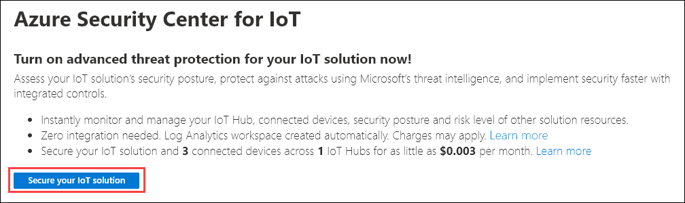
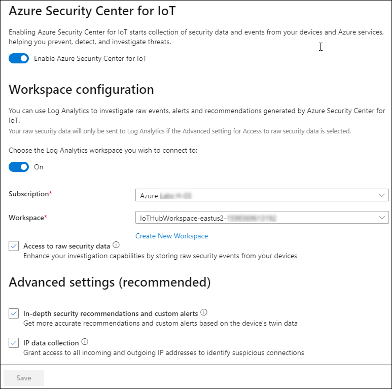
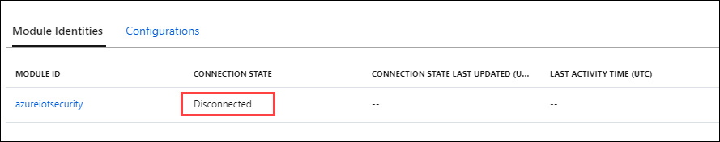
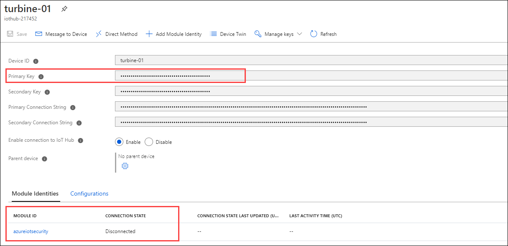
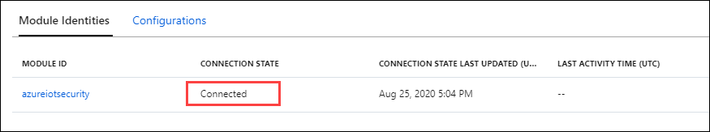
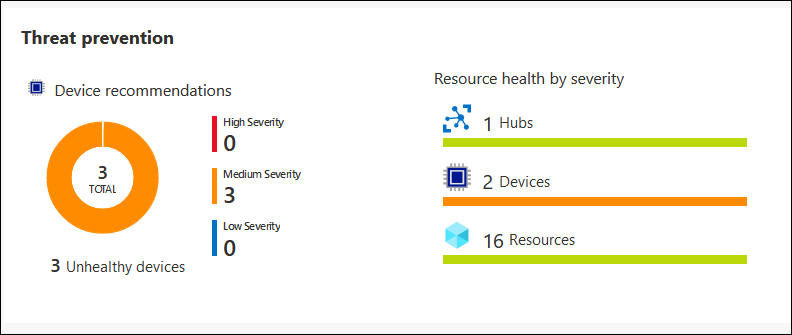
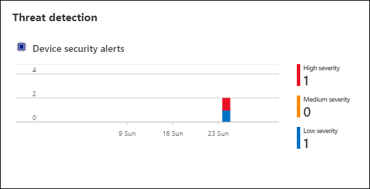
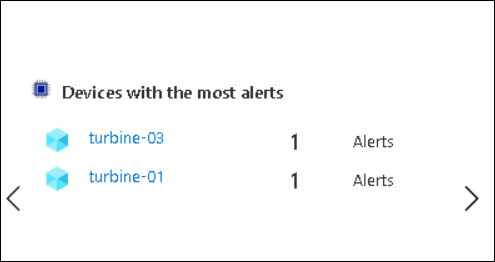

# Exercise 5: Securing the IoT	

## Scenario

With IoT solution roll out, CTO is concerned about the overall security, specifically around STRIDE threats (spoofing of user identity, tampering, repudiation, information disclosure, denial of service, elevation of privilege).

How can you ensure that solution is secure end to end?


## Overview

In this exercise, you will complete the following activities:

* Enable Azure Security Center for IoT
* Create a Security Module Twin
* Install Security center Agent on a Linux Machine
* Configure monitored resources
* Create custom alerts
* Review the alert in the Azure Security Center

## Instructions

### Task 1: Enable Azure Security Center for IoT Hub

Azure Security Center for IoT enables you to unify security management and enable end-to-end threat detection and analysis across hybrid cloud workloads and your Azure IoT solution.

In this task, you will enable **Azure Security Center for IoT** for your IoT Hub. 

1. On the resource group tile, click **iot-{deployment-id}** and select the existing iothub named **iothub-{deployment-id}**.

1. On the left-side menu, under **Security**, click **Overview**.

    Azure Security Center for IoT Hub will onboard the first time a Security pane is opened. 

1. If the **Secure your IoT solution** button is displayed, click **Secure your IoT solution**, and then refresh your browser window when prompted.

   

    > **Note**: After a few moments you will see the message **Onboarding succeeded for this IoT hub, please refresh for changes to take effect**

1. Take a moment to review the contents on the Security Overview pane.

    > **Note**: Threats are not instantly detected the first moment that you onboard Azure Security Center for IoT, you will begin to see threat detections reported on this Overview pane before the end of this lab. 

#### Log Analytics creation

When Azure Security Center for IoT is turned on, a default Azure Log Analytics workspace is created to store raw security events, alerts, and recommendations for your IoT devices, IoT Edge, and IoT Hub.

In this task, you will take a quick look at the workspace configuration of Log Analytics.

1. Open the Security Overview pane for your IoT Hub.

1. At the top of the blade, to show the security settings, click **Settings**. 

    The **Settings page** blade should now be open with the **Data Collection** option displayed under **Names**
    
1. Select **Data Collection** and take a minute to review the Settings information displayed.
   
   

    > **Note**: Notice the **Workspace configuration** that has be defined for your Log Analytics workspace. By default, turning on the Azure Security Center for IoT solution automatically secures all IoT Hubs under your Azure subscription. It may take some time to see the Log Analytics workspace.

1. If the Log Analytics workspace is not yet configured, click **Create New Workspace** under **Workspace Configuration**.

1. In the **Log Analytics workspace** pane provide a unique name like **iotworkspace-{deployment-id}** , keep the remaining as default and click **OK**.

1. Once the deployment got succeeded, select the workspace you have created just now from the drop-down for **Workspace**.

1. Click **Save** to save the Data Collection Configurations.

### Task 2: Create a Security Module Twin

Azure Security Center for IoT offers full integration with your existing IoT device management platform, enabling you to manage your device security status as well as make use of existing device control capabilities.

Azure Security Center for IoT makes use of the module twin mechanism and maintains a security module twin named azureiotsecurity for each of your devices. The security module twin holds all the information relevant to device security for each of your devices. To make full use of Azure Security Center for IoT features, you will need to create, configure, and use these security module twins for your new IoT Edge device.

The security module twin (**azureiotsecurity**) can be created by using either of the following methods:

* Use the [Module batch script](https://github.com/Azure/Azure-IoT-Security/tree/master/security_module_twin). This script automatically creates a module twin for new devices (or devices without a module twin) using the default configuration.

* Manually edit each module twin individually with specific configurations for each device.

In this task, you will be creating a security module twin manually.

1. Navigate to your resource group tile, click **iot-{deployment-id}** and select IoT Hub named **iothub-{deployment id}**.

1. From the left-side menu, click **IoT devices** under **Explorers**.

1. Under **DEVICE ID**, click **turbine-01**.

    You may need to click **Load More** in order to see your device listed.

1. On the **turbine-01** blade, near the top of the blade, click **+ Add Module Identity**.

1. On the **Add Module Identity** pane, under **Module Identity Name**, enter **azureiotsecurity**

    You will be using Symmetric Keys for authentication, so you can leave all over fields at their defaults.

1. At the bottom of the pane, click **Save**.

1. On the **turbine-01** blade, under **Module Identities**, you should now see your **azureiotsecurity** device listed.

    Notice that the connection state is **Disconnected**.
    
    

    > **IMPORTANT**: The Module Identity must be called **azureiotsecurity** and not another unique name.

1. On the **turbine-01** blade, to the right of **Primary Key**, click **Copy**, and then save the value for later.

    > **Note**: Make sure to copy the device's **Primary Key** and not the connection string.

    

1. Navigate back to your IoT Hub blade.

1. On the left-side menu, click **Overview**.

1. In the Essentials area near the top of the blade, to the right of **Hostname**, click **Copy to clipboard**, and then save the value for later.

    > **Note**: The IoT Hub Hostname looks similar to: iothub-2144XX.azure-devices.net

### Task 3: Deploy Azure Security Center for IoT Security Agent

Azure Security Center for IoT provides a reference architecture for security agents that log, process, aggregate, and send security data through IoT Hub. There are C and based agents. C agents are recommended for devices with more restricted or minimal device resources.

In this exercise, you will be adding a security agent that you will deploy to your simulated device. 

#### Logging into Linux VM

1. Navigate to you Linux machine **linuxagentvm-{deployment-id}** in Azure Portal by selecting Resource groups from the Azure home page, and then select the **linuxagentvm-{deployment-id}** Linux VM resource from the list.

1. At the top of the blade, click **Connect**, and then click **SSH**.

1. Use the sample SSH command to create a command for connection to your VM.

   Copy the example command to a text editor, and then remove `-i <private key path> from the command. You should be left with a command in the following format:

    ```cmd\sh
    ssh <admin user>@<ip address>
    ```

    Your command should look similar to: `ssh demouser@52.170.205.79`

1. On the Azure portal toolbar, click **Cloud Shell**.

    Ensure that the **Bash** environment is selected within the Cloud Shell.

1. At the Cloud Shell command prompt, enter the `ssh` command that you created above, and then press **Enter**.

1. When prompted with **Are you sure you want to continue connecting?**, type **yes** and then press **Enter**.

    This prompt is a security confirmation since the certificate used to secure the connection to the VM is self-signed. The answer to this prompt will be remembered for subsequent connections, and is only prompted on the first connection.

1. When prompted to enter the password, enter **Password.1!!**.

    Notice that, once connected, the terminal command prompt will change to show the name of the Linux VM, similar to the following.

    ```cmd/sh
    demouser@linuxagentvm-{your-id}:~$
    ```

    This helps you to keep track of which VM you are connected to and the current user.

#### Add Symmetric Keys to your device

You can connect to your IoT Hub with the security agent. To implement the connection, you will need your device's symmetric key or certificate information.

In this lab, you will be using the symmetric key as authentication and will need to store it in a temporary text document on the device.

1. Verify that you have the **Primary key** value for your **turbine-01** IoT device is available.

   > **Note**:You should have saved the Primary key value earlier in this lab. If not, complete the following:

    1. Navigate to the resourcegroup and select the IoT Hub named **iothub-{deployment-id}**
    1. On the left-side menu, under **Explorers**, click **IoT devices**.
    1. Under **DEVICE ID**, click **turbine-01**.
    1. From the list of details, copy your **Primary Key**.
    1. Return the the Azure Cloud Shell - you should still be connected to your **linuxagentvm-{deployment-id}** virtual machine.

1. At the Cloud Shell command prompt, enter the following command:

    ```cmd/sh
    echo "<primary_key>" > s.key
    ```

    This command will create a device Authentication type file with your **turbine-01** device's **Primary Key**.

    > **Note**: To check if you added the correct Primary key into the file, open your file with `nano s.key` command. Check to see your device's **Primary Key** is in the file. To exit the nano editor, holding `Ctrl` and `X`. Save file by holding `shift` and `Y`. Then hit enter.

#### Installing Security Agent

1. Ensure that the Cloud Shell session is still connected to your VM via SSH.

1. At the Cloud Shell command prompt, customize and then run the following command: 

    You will need to replace the placeholder values with your authentication parameters.

    ```bash
    cd /var/ASCIoTAgent
    sudo ./InstallSecurityAgent.sh -i -aui Device -aum SymmetricKey -f <Insert file location of your s.key file> -hn <Insert your full IoT Hub host name> -di <Device name>
    ```

    Here is an example of what the command should look like:

    `sudo ./InstallSecurityAgent.sh -i -aui Device -aum SymmetricKey -f /home/demouser/s.key -hn iothub-214XXX.azure-devices.net -di turbine-01`

    > **Note**: Make sure that specify your IoT Hub Hostname instead of the one listed 
    > Use pwd command to find the file location.
   
    > **IMPORTANT**:
    > Ensure you use the full IoT Hub host name - i.e. **iothub-{deployment-id}.azure-devices.net** for the `-hn` switch value.

    This script performs the following function:

    * Installs prerequisites.
    * Adds a service user (with interactive sign in disabled).
    * Installs the agent as a Daemon - assumes the device uses **systemd** for service management.
    * Configures **sudo users** to allow the agent to do certain tasks as root.
    * Configures the agent with the authentication parameters provided.

1. Observe the progress of the command by watching output in the Cloud Shell terminal.

    Notice that a reboot is required to complete agent installation.

1. In the Cloud Shell terminal, to start the reboot, enter **y**

    The SSH session will be lost when the device reboots.
 
1. At the Cloud Shell command prompt, to reconnect to your virtual machine, enter the SSH command you used earlier.

    Your Azure Security Center for IoT Agent should now be active and running.

1. At the Cloud Shell command prompt, to check the deployment status of the Azure Security Center for IoT Agent, enter the following command. 

    ```cmd/sh
    systemctl status ASCIoTAgent.service
    ```

    You should see output similar to:

    ```log
    ● ASCIoTAgent.service - Azure Security Center for IoT Agent
       Loaded: loaded (/etc/systemd/system/ASCIoTAgent.service; enabled; vendor preset: enabled)
       Active: active (running) since Wed 2020-01-15 19:08:15 UTC; 3min 3s ago
     Main PID: 1092 (ASCIoTAgent)
        Tasks: 7 (limit: 9513)
       CGroup: /system.slice/ASCIoTAgent.service
            └─1092 /var/ASCIoTAgent/ASCIoTAgent
    ```

    Specifically, you should verify that the service is **Loaded: loaded** and **Active: active (running)**.

    > **Note**: If your Azure Security Center for IoT Agent isn't running or active, please check out [Deploy Azure Security Center for IoT C# based security agent for Linux Guide Troubleshooting Section](https://docs.microsoft.com/en-us/azure/asc-for-iot/how-to-deploy-linux-cs). Common issues are that might leave the service **Active: activating** are an incorrect key value or not specifying the full IoT Hub hostname.

1. On the resource group tile, navigate to **iot-{deployment-id}** and select the existing iothub named **iothub-{deployment-id}**.

    Open your IoT Hub blade, on the navigation menu under **Explorers**, click **IoT devices**, and then click **turbine-01**.

1. Under **Module Identities**, notice that your **azureiotsecurity** module is now in a **Connected** state.

    

Now that your Azure Security Center for IoT device agents are installed on your device, the agents will be able to collect, aggregate and analyze raw security events from your device.

### Task 4: Configure Azure Security Center for IoT

Azure Security Center for IoT provides end-to-end security for Azure-based IoT solutions.

With Azure Security Center for IoT, you can monitor your entire IoT solution in one dashboard, surfacing all of your IoT devices, IoT platforms and back-end resources in Azure.

Once enabled on your IoT Hub, Azure Security Center for IoT automatically identifies other Azure services, also connected to your IoT Hub and related to your IoT solution.

In addition to automatic relationship detection, you can also pick and choose which other Azure resource groups to tag as part of your IoT solution. Your selections allow you to add entire subscriptions, resource groups, or single resources.

#### Open IoT Hub

1. In your browser, open the Azure Portal and navigate to your IoT Hub.

1. On the left-side menu, under **Security**, click **Settings**.

1. From the **Settings Page** pane appeared, select **Monitored Resources** under **Names**

1. At the top of the pane, click **Edit**.

    The **Solution Management** pane opens, where you can connect additional Azure resources to your security solution by selecting their owning resource groups.

1. Under **Subscriptions**, select the subscription you have access to.

1. In the **Resource groups** dropdown, click **iot-{deployment-id}**.

1. At the bottom of the **Solution Management** pane, click **Apply**.

    If the **Apply** button is not available, don't worry, the resources were already added.

1. Close the **Solution Management** pane.

After defining all of the resource relationships, Azure Security Center for IoT leverages Azure Security Center to provide you security recommendations and alerts for these resources.

#### View Azure Security Center for IoT in Action

You now have your the security agent installed on your device and your solution configured. It is a good time to check out the different views for Azure Security Center for IoT.

1. On the left-side menu, under **Security**, click **Overview**. 

    You will see the health overview for your devices, hubs, and other resources appear on two charts. You can see the Built-in real-time monitoring, recommendations and alerts that were enabled right when you turn on your Azure IoT Security Center.

    The image below shows the dashboard status once the security evaluation has been performed.
    
    

    > **IMPORTANT**:
    > The process that evaluates the security configuration of your IoT resources may take up to 24 hours to run, therefore the initial status displayed on the dashboard does not reflect the actual state of your resources. 
    
### Task 5: Introduce custom alerts

Custom security groups and alerts can be used to take full advantage of the end-to-end security information and categorical device knowledge across your full IoT solution. This will help you to provide better security for your solution. 

Azure Security Center for IoT allows you to translate this understanding into a device behavior policy and alert on any deviation from expected, normal behavior.

#### Customize an alert

As mentioned above, customers that understand the specific desired behavior of their solution can configure custom alerts that trigger when the desired behavior is exceeded. In this exercise, you will create a custom alert that monitors **Device to Cloud** messages sent via the **MQTT** protocol.

1. Open **Iot Simulator App** and start sending telemetry data for devices.

1. On your Azure portal, navigate to your IoT Hub blade.

1. On the left-side menu, under **Security**, click **Settings**.

1. From the **Settings Page** pane appeared, select **Custom Alerts** under **Names**

1. Take a moment to examine the **Custom Alerts** pane.

    At first glance, it may appear that this pane is empty, but the item listed under **Name** is actually the **default** security group, which is created for you automatically.

    Security groups enable you to define logical groups of devices, and manage their security state in a centralized way. These groups can represent devices with specific hardware, devices deployed in a certain location, or any other group suitable to your specific needs.

1. To add a custom alert to the default security group, click **default**.

    The **Device Security Group** blade lists all active custom alerts. Since this is the first time you have visited this blade, it will be empty.

1. At the top of the blade, click **Create custom alert rule**.

    The **Create custom alert rule** pane will open. Notice that the **Device Security Group** field is populated with the **default** group.

1. In the **Custom Alert** dropdown, click **Number of device to cloud messages (MQTT protocol) is not in allowed range**.

    > **Tip**:
    > Review the the many custom alerts available. Consider how they can be used to secure your solution.

    > **Note**:
    > The **Description** and **Required Properties** will change depending upon the **Custom Alert** that is chosen.

1. Under **Required Properties**, in the **Minimal Threshold** field, enter **1**.

    This satisfies the expectation that at least one message should be sent in a 5 minute period.

1. Under **Maximal Threshold**, enter **5**.

    This satisfies the expectation that no more than five messages should be sent in a 5 minute period.

1. In the **Time Window Size** dropdown, click **00:05:00**.

1. At the bottom of the **Create custom alert rule** pane, click **OK**.

1. At the top of the **default** (Device Security Group) blade, click **Save**.

    Without saving the new alert, the alert is deleted the next time you close IoT Hub. You will be returned to the list of custom alerts. 
    
### Task 6: IoT Device with Device Twin

#### Configuring the IoT Device with Device Twin

*Device twins* are JSON documents that store device state information including metadata, configurations, and conditions. Azure IoT Hub maintains a device twin for each device that you connect to IoT Hub.

A device must be registered with your IoT hub before it can connect.

1. On your Azure portal, navigate to your IoT Hub blade.

1. On the left-side menu, under **Explorers**, click **IoT devices**.

1. At the top of the **IoT devices** pane, click  **turbine-01**

1. To display the device twin, click **Device Twin**.

    The existing device twin JSON will be displayed and will be similar to the following:

    ```json
    {
        "deviceId": "turbine-01",
        "etag": "AAAAAAAAAAE=",
        "deviceEtag": "Mjg2NzY5NzAw",
        "status": "enabled",
        "statusUpdateTime": "0001-01-01T00:00:00Z",
        "connectionState": "Disconnected",
        "lastActivityTime": "0001-01-01T00:00:00Z",
        "cloudToDeviceMessageCount": 0,
        "authenticationType": "sas",
        "x509Thumbprint": {
            "primaryThumbprint": null,
            "secondaryThumbprint": null
        },
        "version": 2,
        "tags": {
            "SecurityGroup": "default"
        },
        "properties": {
            "desired": {
                "$metadata": {
                    "$lastUpdated": "2020-06-11T13:09:38.4712899Z"
                },
                "$version": 1
            },
            "reported": {
                "$metadata": {
                    "$lastUpdated": "2020-06-11T13:09:38.4712899Z"
                },
                "$version": 1
            }
        },
        "capabilities": {
            "iotEdge": false
        }
    }
    ```

1. To add the device to the **default** security group, insert the following JSON between the **version** and **properties** fields:

    ```json
    "tags": {
        "SecurityGroup": "default"
    },
    ```

    The resultant JSON will be similar to:

    ```json
    {
        "deviceId": "turbine-01",
        "etag": "AAAAAAAAAAE=",
        "deviceEtag": "Mjg2NzY5NzAw",
        "status": "enabled",
        "statusUpdateTime": "0001-01-01T00:00:00Z",
        "connectionState": "Disconnected",
        "lastActivityTime": "0001-01-01T00:00:00Z",
        "cloudToDeviceMessageCount": 0,
        "authenticationType": "sas",
        "x509Thumbprint": {
            "primaryThumbprint": null,
            "secondaryThumbprint": null
        },
        "version": 2,
        "tags": {
            "SecurityGroup": "default"
        },
        "properties": {
            "desired": {
                "$metadata": {
                    "$lastUpdated": "2020-06-11T13:09:38.4712899Z"
                },
                "$version": 1
            },
            "reported": {
                "$metadata": {
                    "$lastUpdated": "2020-06-11T13:09:38.4712899Z"
                },
                "$version": 1
            }
        },
        "capabilities": {
            "iotEdge": false
        }
    }
    ```

1. To apply the updated JSON, click **Save**.

1. Close the **Device Twin** pane and minimise the azure portal.

1. Open the **IoT Similator App** and start sending telemertry data by clicking **Send Telemetry** button.

### Task 7: Review Security Center Alerts

At this point, your console app will have sent enough telemetry to trigger the Custom Alert created earlier. 

> **Note**: The alert was set up to trigger if less than 1 and more than 5 messages where sent from a device to the cloud within a 5 minute time window.

#### Review the Security Center Dashboard

1. On your Azure portal, navigate to your IoT Hub blade.

1. On the left-side menu, under **Security**, click **Overview**.

    Take a look at the **Threat detection** section. You should see one or more alerts displayed in the **Device security alerts** chart:

    

    You should also see an entry for the **turbine01** device in the **Devices with the most alerts** tile:

    > **Note**: It can take between 10 and 15 minutes for alerts to be displayed on the dashboard.

1. Under **Threat detection**, click the **Devices with the most alerts** tile.

    This will open the same **Alerts** blade as you would see if you were to click **Security Alerts** under **Security** on the left-side menu.

    You will see a list of Security Alerts:

    

    The latest alerts will be marked with a **NEW** label.

1. Minimise the Azure Portal and open the **IoT Simulator App**.

1. Stop sending Telemetry data by clicking the button **Stop Telemetry**.

