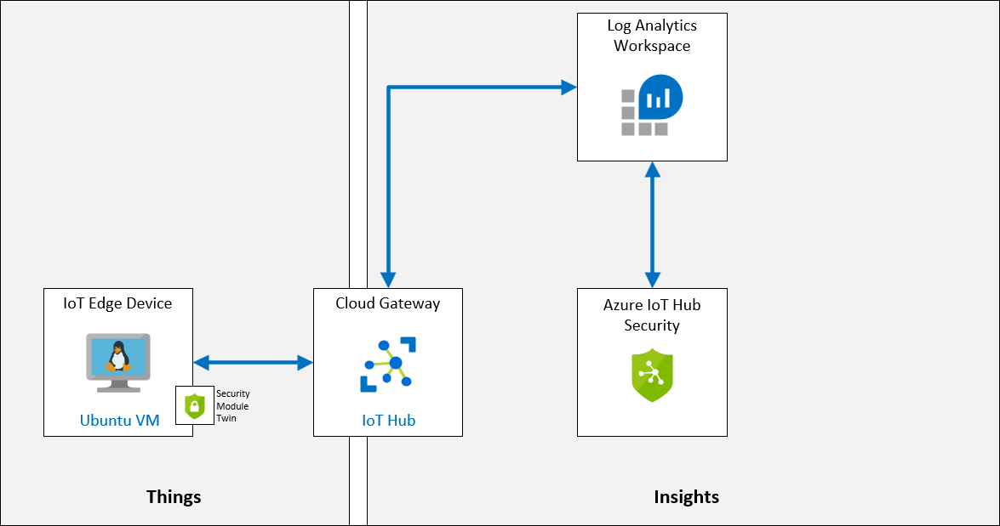

# Securing the IoT	

## Lab Scenario

With IoT solution roll out, CTO is concerned about the overall security, specifically around STRIDE threats (spoofing of user identity, tampering, repudiation, information disclosure, denial of service, elevation of privilege).

How can you ensure that solution is secure end to end?



## In This Lab

In this lab, you will complete the following activities:

* Verify that the lab prerequisites are met (that you have the required Azure resources)

    * The script will create an IoT Hub if needed

* Enable Azure Security Center for IoT
* Create a Security Module Twin
* Install C#-based Security Agent on a Linux Device
* Configure monitored resources
* Create custom alerts
* Review the alert in the Azure Security Center

## Lab Instructions

### Exercise 1: Enable Azure Security Center for IoT Hub

Azure Security Center for IoT enables you to unify security management and enable end-to-end threat detection and analysis across hybrid cloud workloads and your Azure IoT solution.

Azure Security Center for IoT is composed of the following components:

* IoT Hub integration
* Device agents (optional)
* Send security message SDK
* Analytics pipeline

#### Task 1: Enable Azure Security Center for IoT

In this task, you will enable **Azure Security Center for IoT** for your IoT Hub. 

1. If necessary, log in to your Azure portal using your Azure account credentials.

    If you have more than one Azure account, be sure that you are logged in with the account that is tied to the subscription that you will be using for this course.

1. On your Azure dashboard, click **iot-az220-training-{your-id}**.

    The rg-az220 resource group tile on your dashboard should have a link to your IoT Hub.

1. On the left-side menu, under **Security**, and then click **Overview**.

    Azure Security Center for IoT Hub will onboard the first time a Security pane is opened. 

1. If the **Secure your IoT solution** button is displayed, click **Secure your IoT solution**, and then refresh your browser window when prompted.

    After a few moments you will see the message **Onboarding succeeded for this IoT hub, please refresh for changes to take effect**

1. Take a moment to review the contents on the Security Overview pane.

    > **Note**: Threats are not instantly detected the first moment that you onboard Azure Security Center for IoT, you will begin to see threat detections reported on this Overview pane before the end of this lab. 

#### Task 2: Log Analytics creation

When Azure Security Center for IoT is turned on, a default Azure Log Analytics workspace is created to store raw security events, alerts, and recommendations for your IoT devices, IoT Edge, and IoT Hub.

In this task, you will take a quick look at the workspace configuration of Log Analytics.

1. If needed, open the Security Overview pane for your IoT Hub.

1. At the top of the blade, to show the security settings, click **Settings**. 

    The **Settings** blade should now be open with the **Data Collection** pane displayed. 

1. Take a minute to review the Settings information displayed.

    Notice the **Workspace configuration** that has be defined for your Log Analytics workspace.

By default, turning on the Azure Security Center for IoT solution automatically secures all IoT Hubs under your Azure subscription.

### Exercise 2: Create and Register a New Device

In this exercise, you will be setting up a virtual machine that you will then use to simulate an IoT device. Later on in this lab, you will use this device to measure vibrations on a conveyor belt.

#### Task 1: Create a new IoT Device

In this task, you will create a Virtual Machine that will represent your IoT device. You are using a VM in this lab rather than simulated device code because you will be installing a security module to the IoT device (VM).

1. Login to [portal.azure.com](https://portal.azure.com) using your Azure account credentials.

1. On the Azure portal menu, click **Create a resource**.

1. On the **New** blade, in the Search the Marketplace textbox, type **Ubuntu Server 18.04 LTS** and then press **Enter**.

1. On the **Ubuntu Server 18.04 LTS** blade, click **Create**.

1. On the **Create a virtual machine** blade, under **Subscription**, ensure that the Subscription you are using for this course is selected.

1. In the **Resource group** dropdown, click **rg-az220vm**.

    > **Note**: A single resource group is being used to track and manage all of the Virtual Machine resources created during this course. If the **rg-az220vm** resource group has not already been created, use the following instructions to create it now:
 
    * Under the **Resource group** dropdown, click **Create new**.
    * In the context menu, under **Name**, type **rg-az220vm** and then click **OK**

    > **Note**: You may encounter guidance that suggests creating a separate resource group for each of your VMs. Having a separate resource group for each VM can help you to manage any addition resources that you add to the VM. For the simple manner in which you use VMs in this course, having separate resource groups for each VM is not necessary or practical.

1. In the **Virtual machine name** textbox, enter **vm-az220-training-edge0002-{your-id}**

1. In the **Region** dropdown, select the Azure Region closest to you, or the region where your Azure IoT Hub is provisioned.

1. In the **Availability options** dropdown, ensure that **No infrastructure redundancy required** is selected.

    > **Tip**:
    > Azure offers a range of options for managing availability and resiliency for your applications. Architect your solution to use replicated VMs in Availability Zones or Availability Sets to protect your apps and data from datacenter outages and maintenance events. In this lab, we don't required any high-availability features.

1. In the **Image** dropdown, notice that **Ubuntu Server 18.04 LTS** is selected.

1. For the **Azure Spot instance** field, ensure that **No** is selected.

    > **Tip**:
    > Using Spot VMs allows you to take advantage of Azure unused capacity at a significant cost savings. At any point in time when Azure needs the capacity back, the Azure infrastructure will evict Spot VMs. Therefore, Spot VMs are great for workloads that can handle interruptions like batch processing jobs, dev/test environments, large compute workloads, and more. For this lab, we'll use a traditional VM.

1. Under **Administrator account**, to the right of **Authentication type**, click **Password**.

1. For the Administrator **Username** and **Password** fields, enter values for the VM Administrator account.

    > **Important**: Make a record of the VM Administrator username and password. In a production environment, you would need to keep these secure. For this lab it is okay to save the values to a text document so that you can find them later (in case you forget). 

1. To the right of **Inbound port rules**, notice that **SSH (22)** is selected.

    You will be using SSH to remote into the VM when you need to configure/manage the VM.

1. At the bottom of the blade, click **Review + create**.

1. Once you see the "Validation passed" message, click **Create**.

    > **Note**:
    > Deployment can take approximately 5 minutes to complete. You can continue on to the next unit while it is deploying.

#### Task 2: Register New Devices

As a device must be registered with your IoT hub before it can connect, let's create the registration.

1. On the Azure portal menu, click **Dashboard**.

1. On your rg-az220 resource group tile, click **iot-az220-training-{your-id}**.

    There are plenty of other ways to open your IoT Hub blade, use whatever method you prefer.

1. In the left-side menu, under **Explorers**, click **IoT devices**.

1. At the top of **IoT devices** pane, click **+ New**

1. Under **Device ID**, enter **vm-az220-training-edge0002-{your-id}**

    Yes, you are using the Name that you assigned to the VM as the Device ID.

    You will be using a **Symmetric key** for authentication, so you can leave the other setting at the defaults.

1. At the bottom of the blade, click **Save**.

### Exercise 3: Create a Security Module Twin

Azure Security Center for IoT offers full integration with your existing IoT device management platform, enabling you to manage your device security status as well as make use of existing device control capabilities.

Azure Security Center for IoT makes use of the module twin mechanism and maintains a security module twin named azureiotsecurity for each of your devices. The security module twin holds all the information relevant to device security for each of your devices. To make full use of Azure Security Center for IoT features, you will need to create, configure, and use these security module twins for your new IoT Edge device.

The security module twin (**azureiotsecurity**) can be created by using either of the following methods:

* Use the [Module batch script](https://github.com/Azure/Azure-IoT-Security/tree/master/security_module_twin). This script automatically creates a module twin for new devices (or devices without a module twin) using the default configuration.
* Manually edit each module twin individually with specific configurations for each device.

In this task, you will be creating a security module twin manually.

1. In the Azure portal, if necessary, navigate to your the **IoT devices** pane of your IoT Hub.

    To open the **IoT devices** pane from your IoT Hub blade, in the left-side menu, under **Explorers**, click **IoT devices**.

1. Under **DEVICE ID**, click **vm-az220-training-edge0002-{your-id}**.

    You may need to click **Load More** in order to see your device listed.

1. On the **vm-az220-training-edge0002-{your-id}** blade, near the top of the blade, click **+ Add Module Identity**.

1. On the **Add Module Identity** pane, under **Module Identity Name**, enter **azureiotsecurity**

    You will be using Symmetric Keys for authentication, so you can leave all over fields at their defaults.

1. At the bottom of the pane, click **Save**.

1. On the **vm-az220-training-edge0002-{your-id}** blade, under **Module Identities**, you should now see your **azureiotsecurity** device listed.

    Notice that the connection state is **Disconnected**.

    > **IMPORTANT**: The Module Identity must be called **azureiotsecurity** and not another unique name.

    

1. On the **vm-az220-training-edge0002-{your-id}** blade, to the right of **Primary Key**, click **Copy**, and then save the value for later.

    > **Note**: Make sure to copy the device's **Primary Key** and not the connection string.

    

1. Navigate back to your IoT Hub blade.

1. On the left-side menu, click **Overview**.

1. In the Essentials area near the top of the blade, to the right of **Hostname**, click **Copy to clipboard**, and then save the value for later.

    > **Note**: The IoT Hub Hostname looks similar to: iot-az220-training-cah102119.azure-devices.net

### Exercise 4: Deploy Azure Security Center for IoT C# Security Agent

Azure Security Center for IoT provides a reference architecture for security agents that log, process, aggregate, and send security data through IoT Hub. There are C and C# based agents. C agents are recommended for devices with more restricted or minimal device resources.

Security agents support the following features:

* Collect raw security events from the underlying Operating System (Linux, Windows). To read more about available security data collectors, see Azure Security Center for IoT agent configuration.
* Aggregate raw security events into messages sent through IoT Hub.
* Authenticate with existing device identity, or a dedicated module identity. To read more, see Security agent authentication methods.
* Configure remotely through use of the **azureiotsecurity** module twin. To read more, see Configure an Azure Security Center for IoT agent.

In this exercise, you will be adding a security agent for C# that you will deploy to your simulated device (Linux VM). 

#### Task 1: Logging into IoT Device - Linux VM

1. If necessary, log in to your Azure portal using your Azure account credentials.

    If you have more than one Azure account, be sure that you are logged in with the account that is tied to the subscription that you will be using for this course.

1. On the Azure portal menu, click **All resources**.

    Be sure to select **All resources**, not **All services**.

1. On the **All resources** blade, in the **Filter by name** textbox, enter **vm-az220-training-edge0002**

1. Under **Name**, click **vm-az220-training-edge0002-{your-id}**.

    The Overview pane for your newly created virtual machine (**vm-az220-training-edge0002-{your-id}**) should now be open.

1. At the top of the blade, click **Connect**, and then click **SSH**.

1. Take a minute to review the contents of the **Connect** pane

    As you have seen previously in this course, you are provided with an example command for opening an SSH connection.

1. Use the sample SSH command to create a command for connection to your VM.

    Copy the example command to a text editor, and then remove `-i <private key path> from the command. You should be left with a command in the following format:

    ```cmd\sh
    ssh <admin user>@<ip address>
    ```

    Your command should look similar to: `ssh demouser@52.170.205.79`

1. On the Azure portal toolbar, click **Cloud Shell**.

    Ensure that the **Bash** environment is selected within the Cloud Shell.

1. At the Cloud Shell command prompt, enter the `ssh` command that you created above, and then press **Enter**.

1. When prompted with **Are you sure you want to continue connecting?**, type **yes** and then press **Enter**.

    This prompt is a security confirmation since the certificate used to secure the connection to the VM is self-signed. The answer to this prompt will be remembered for subsequent connections, and is only prompted on the first connection.

1. When prompted to enter the password, enter the Administrator password that you created for the VM.

    Notice that, once connected, the terminal command prompt will change to show the name of the Linux VM, similar to the following.

    ```cmd/sh
    demouser@vm-az220-training-edge0002-{your-id}:~$
    ```

    This helps you to keep track of which VM you are connected to and the current user.

#### Task 2: Add Symmetric Keys to your device

You can connect to your IoT Hub with the C# version of the security agent. To implement the connection, you will need your device's symmetric key or certificate information.

In this lab, you will be using the symmetric key as authentication and will need to store it in a temporary text document on the device.

1. Verify that you have the **Primary key** value for your **vm-az220-training-edge0002-{your-id}** device available.

    You should have saved the Primary key value earlier in this lab. If not, complete the following:

    1. Open a new browser tab, and on that new tab, navigate to the Azure portal.
    1. On the Azure portal menu, click **Dashboard**, and then open your IoT Hub.
    1. On the left-side menu, under **Explorers**, click **IoT devices**.
    1. Under **DEVICE ID**, click **vm-az220-training-edge0002-{your-id}**.
    1. From the list of details, copy your **Primary Key**.
    1. Return the the Azure Cloud Shell browser tab - you should still be connected to your **vm-az220-training-edge0002-{your-id}** virtual machine.

1. At the Cloud Shell command prompt, enter the following command:

    ```cmd/sh
    echo "<primary_key>" > s.key
    ```

    This command will create a device Authentication type file with your **vm-az220-training-edge0002-{your-id}** device's **Primary Key**.

    > **Note**: To check if you added the correct Primary key into the file, open your file with `nano s.key` command. Check to see your device's **Primary Key** is in the file. To exit the nano editor, holding `Ctrl` and `X`. Save file by holding `shift` and `Y`. Then hit enter.

#### Task 4: Installing Security Agent

1. Ensure that the Cloud Shell session is still connected to your VM via SSH.

1. At the Cloud Shell command prompt, to download the most recent version of Security Agent for C# to your device, enter the following command:

    ```bash
    wget https://github.com/Azure/Azure-IoT-Security-Agent-CS/releases/download/0.0.6/ubuntu-18.04-x64.tar.gz
    ```

    > **Note**: Notice that the command above targets Ubuntu Server 18.04 LTS

1. At the Cloud Shell command prompt, to extract the contents of the package and navigate to the `/Install` folder, enter the following command:

    ```bash
    tar -xzvf ubuntu-18.04-x64.tar.gz && cd Install
    ```

1. At the Cloud Shell command prompt, to add execute permissions to the `InstallSecurityAgent` script, enter the following command:

    ```bash
    chmod +x InstallSecurityAgent.sh
    ```

1. At the Cloud Shell command prompt, customize and then run the following command: 

    You will need to replace the placeholder values with your authentication parameters.

    ```bash
    sudo ./InstallSecurityAgent.sh -i -aui Device -aum SymmetricKey -f <Insert file location of your s.key file> -hn <Insert your full IoT Hub host name> -di vm-az220-training-edge0002-{your-id}
    ```

    Here is an example of what the command should look like:

    `sudo ./InstallSecurityAgent.sh -i -aui Device -aum SymmetricKey -f ../s.key -hn iot-az220-training-ab200213.azure-devices.net -di vm-az220-training-edge0002-{your-id}`

    > **Note**: Make sure that specify your IoT Hub Hostname instead of the one listed 
    
    > **IMPORTANT**:
    > Ensure you use the full IoT Hub host name - i.e. **iot-az220-training-ab200213.azure-devices.net** for the `-hn` switch value.

    This script performs the following function:

    * Installs prerequisites.
    * Adds a service user (with interactive sign in disabled).
    * Installs the agent as a Daemon - assumes the device uses **systemd** for service management.
    * Configures **sudo users** to allow the agent to do certain tasks as root.
    * Configures the agent with the authentication parameters provided.

1. Observe the progress of the command by watching output in the Cloud Shell terminal.

    Notice that a reboot is required to complete agent installation.

1. In the Cloud Shell terminal, to start the reboot, enter **y**

    The SSH session will be lost when the device reboots.
 
1. At the Cloud Shell command prompt, to reconnect to your virtual machine, enter the SSH command you used earlier.

    Your Azure Security Center for IoT Agent should now be active and running.

1. At the Cloud Shell command prompt, to check the deployment status of the Azure Security Center for IoT Agent, enter the following command. 

    ```cmd/sh
    systemctl status ASCIoTAgent.service
    ```

    You should see output similar to:

    ```log
    ● ASCIoTAgent.service - Azure Security Center for IoT Agent
       Loaded: loaded (/etc/systemd/system/ASCIoTAgent.service; enabled; vendor preset: enabled)
       Active: active (running) since Wed 2020-01-15 19:08:15 UTC; 3min 3s ago
     Main PID: 1092 (ASCIoTAgent)
        Tasks: 7 (limit: 9513)
       CGroup: /system.slice/ASCIoTAgent.service
            └─1092 /var/ASCIoTAgent/ASCIoTAgent
    ```

    Specifically, you should verify that the service is **Loaded: loaded** and **Active: active (running)**.

    > **Note**: If your Azure Security Center for IoT Agent isn't running or active, please check out [Deploy Azure Security Center for IoT C# based security agent for Linux Guide Troubleshooting Section](https://docs.microsoft.com/en-us/azure/asc-for-iot/how-to-deploy-linux-cs). Common issues are that might leave the service **Active: activating** are an incorrect key value or not specifying the full IoT Hub hostname.

1. In the Azure portal, navigate back your IoT Hub blade, and then open the **vm-az220-training-edge0002-{your-id}** device blade.

    Open your IoT Hub blade, on the navigation menu under **Explorers**, click **IoT devices**, and then click **vm-az220-training-edge0002-{your-id}**.

1. Under **Module Identities**, notice that your **azureiotsecurity** module is now in a **Connected** state.

    

Now that your Azure Security Center for IoT device agents are installed on your device, the agents will be able to collect, aggregate and analyze raw security events from your device.

### Exercise 5: Configure Solution Management

Azure Security Center for IoT provides end-to-end security for Azure-based IoT solutions.

With Azure Security Center for IoT, you can monitor your entire IoT solution in one dashboard, surfacing all of your IoT devices, IoT platforms and back-end resources in Azure.

Once enabled on your IoT Hub, Azure Security Center for IoT automatically identifies other Azure services, also connected to your IoT Hub and related to your IoT solution.

In addition to automatic relationship detection, you can also pick and choose which other Azure resource groups to tag as part of your IoT solution. Your selections allow you to add entire subscriptions, resource groups, or single resources.

#### Task 1: Open IoT Hub

1. In your browser, open the Azure Portal and navigate to your IoT Hub.

1. On the left-side menu, under **Security**, click **Resources**.

    Note that the list of resources already includes your IoT Hub, the workspace that was created when Azure Security Center for IoT was activated earlier as well as the current subscription.

1. At the top of the pane, click **Edit**.

    The **Solution Management** pane opens, where you can connect additional Azure resources to your security solution by selecting their owning resource groups.

1. Under **Subscriptions**, ensure that the subscription you are using for this course is selected.

    > **Note:**
    > You can add resources from multiple subscriptions to your security solution.

1. In the **Resource groups** dropdown, click **rg-az220vm**.

    You should now have two Resource Groups selected. Notice that the Resources list has updated to reflect the additional resources in the resource group you just added.

1. At the bottom of the **Solution Management** pane, click **Apply**.

    If the **Apply** button is not available, don't worry, the resources were already added.

1. Close the **Solution Management** pane.

After defining all of the resource relationships, Azure Security Center for IoT leverages Azure Security Center to provide you security recommendations and alerts for these resources.

#### Task 2: View Azure Security Center for IoT in Action

You now have your the security agent installed on your device and your solution configured. It is a good time to check out the different views for Azure Security Center for IoT.

1. On the left-side menu, under **Security**, click **Overview**. 

    You will see the health overview for your devices, hubs, and other resources appear on two charts. You can see the Built-in real-time monitoring, recommendations and alerts that were enabled right when you turn on your Azure IoT Security Center.

    

1. On the left-side menu, under **Security**, click **Resources**.

    This pane provides access to the health of your resources across your IoT solution.

    > **IMPORTANT**:
    > The process that evaluates the security configuration of your IoT resources may take up to 24 hours to run, therefore the initial status displayed on the dashboard does not reflect the actual state of your resources. 

    The image below shows the dashboard status once the security evaluation has been performed.

    

### Exercise 6: Introduce custom alerts

Custom security groups and alerts can be used to take full advantage of the end-to-end security information and categorical device knowledge across your full IoT solution. This will help you to provide better security for your solution. 

#### Why use custom alerts?

You know your IoT devices better than an out-of-the-box algorithm.

For customers who fully understand their expected device behavior, Azure Security Center for IoT allows you to translate this understanding into a device behavior policy and alert on any deviation from expected, normal behavior.

#### Task 1 - Customize an alert

As mentioned above, customers that understand the specific desired behavior of their solution can configure custom alerts that trigger when the desired behavior is exceeded. In this exercise, you will create a custom alert that monitors **Device to Cloud** messages sent via the **MQTT** protocol.

Under normal circumstances, Contoso's cheese cave monitoring system will not be sending IoT Hub temperature and humidity data at a high rate. You expect each device to send between one and five device-to-cloud messages in a five minute period. This range accommodates the dusk time period when temperature could be changing more rapidly and more frequent data might be needed to ensure values don't slip outside the established boundary values.

In this task, you will create a custom alert.

1. On your Azure portal, navigate to your IoT Hub blade.

1. On the left-side menu, under **Security**, click **Custom Alerts**.

1. Take a moment to examine the **Custom Alerts** pane.

    At first glance, it may appear that this pane is empty, but the item listed under **Name** is actually the **default** security group, which is created for you automatically.

    Security groups enable you to define logical groups of devices, and manage their security state in a centralized way. These groups can represent devices with specific hardware, devices deployed in a certain location, or any other group suitable to your specific needs.

1. To add a custom alert to the default security group, click **default**.

    The **Device Security Group** blade lists all active custom alerts. Since this is the first time you have visited this blade, it will be empty.

1. At the top of the blade, click **Create custom alert rule**.

    The **Create custom alert rule** pane will open. Notice that the **Device Security Group** field is populated with the **default** group.

1. In the **Custom Alert** dropdown, click **Number of device to cloud messages (MQTT protocol) is not in allowed range**.

    > **Tip**:
    > Review the the many custom alerts available. Consider how they can be used to secure your solution.

    > **Note**:
    > The **Description** and **Required Properties** will change depending upon the **Custom Alert** that is chosen.

1. Under **Required Properties**, in the **Minimal Threshold** field, enter **1**.

    This satisfies the expectation that at least one message should be sent in a 5 minute period.

1. Under **Maximal Threshold**, enter **5**.

    This satisfies the expectation that no more than five messages should be sent in a 5 minute period.

1. In the **Time Window Size** dropdown, click **00:05:00**.

    This satisfies the five minute time period that was established.

    > **Note**:
    There are 4 available time windows:
    > * 5 minutes
    > * 10 minutes
    > * 15 minutes
    > * 30 minutes

1. At the bottom of the **Create custom alert rule** pane, click **OK**.

1. At the top of the **default** (Device Security Group) blade, click **Save**.

    Without saving the new alert, the alert is deleted the next time you close IoT Hub.

    You will be returned to the list of custom alerts. Below is an image that shows a number of custom alerts:

    

### Exercise 8: Configure the Device App

In this exercise, you will configure an IoT Hub device and a .Net Core console application (C#) that will leverage the **Microsoft.Azure.Devices.Client** nuget package to connect to an IoT Hub. The console application will send telemetry every 10 seconds and is designed to exceed the Device to Cloud message threshold configured in the Custom Alert (that you created in the previous exercise).

#### Task 1: Register New IoT Device

A device must be registered with your IoT hub before it can connect.

1. On the Azure portal menu, click **Dashboard**, and then open your IoT Hub.

1. On the left-side menu, under **Explorers**, click **IoT devices**.

1. At the top of the **IoT devices** pane, click  **+ New**

1. On the **Create a device** blade, under **Device ID**, enter **sensor-th-0070**

    You will be using **symmetric Keys** for authentication, so leave the other values at the defaults.

1. At the bottom of the blade, click **Save**.

1. On the **IoT devices** pane, under **Device ID**, click **sensor-th-0070**.

    You may need to click **Load More** in order to access the **sensor-th-0070** device.

1. To display the device twin, click **Device Twin**.

    The existing device twin JSON will be displayed and will be similar to the following:

    ```json
    {
        "deviceId": "sensor-th-0070",
        "etag": "AAAAAAAAAAE=",
        "deviceEtag": "Mjg2NzY5NzAw",
        "status": "enabled",
        "statusUpdateTime": "0001-01-01T00:00:00Z",
        "connectionState": "Disconnected",
        "lastActivityTime": "0001-01-01T00:00:00Z",
        "cloudToDeviceMessageCount": 0,
        "authenticationType": "sas",
        "x509Thumbprint": {
            "primaryThumbprint": null,
            "secondaryThumbprint": null
        },
        "version": 2,
        "tags": {
            "SecurityGroup": "default"
        },
        "properties": {
            "desired": {
                "$metadata": {
                    "$lastUpdated": "2020-06-11T13:09:38.4712899Z"
                },
                "$version": 1
            },
            "reported": {
                "$metadata": {
                    "$lastUpdated": "2020-06-11T13:09:38.4712899Z"
                },
                "$version": 1
            }
        },
        "capabilities": {
            "iotEdge": false
        }
    }
    ```

1. To add the device to the **default** security group, insert the following JSON between the **version** and **properties** fields:

    ```json
    "tags": {
        "SecurityGroup": "default"
    },
    ```

    The resultant JSON will be similar to:

    ```json
    {
        "deviceId": "sensor-th-0070",
        "etag": "AAAAAAAAAAE=",
        "deviceEtag": "Mjg2NzY5NzAw",
        "status": "enabled",
        "statusUpdateTime": "0001-01-01T00:00:00Z",
        "connectionState": "Disconnected",
        "lastActivityTime": "0001-01-01T00:00:00Z",
        "cloudToDeviceMessageCount": 0,
        "authenticationType": "sas",
        "x509Thumbprint": {
            "primaryThumbprint": null,
            "secondaryThumbprint": null
        },
        "version": 2,
        "tags": {
            "SecurityGroup": "default"
        },
        "properties": {
            "desired": {
                "$metadata": {
                    "$lastUpdated": "2020-06-11T13:09:38.4712899Z"
                },
                "$version": 1
            },
            "reported": {
                "$metadata": {
                    "$lastUpdated": "2020-06-11T13:09:38.4712899Z"
                },
                "$version": 1
            }
        },
        "capabilities": {
            "iotEdge": false
        }
    }
    ```

1. To apply the updated JSON, click **Save**.

1. Close the **Device Twin** pane and return to the **sensor-th-0070** detail view.

1. To the right of **Primary connection string**, click **Copy**, and then save the value to a text file.

    Be sure to note that it is the connection string for the sensor-th-0070 device. You will need the connection string value for the device app.

#### Task 2: Configure a Cave Device App

1. Open **Visual Studio Code**.

1. On the **File** menu, click **Open Folder**

1. In the Open Folder dialog, navigate to the lab 19 Starter folder.

1. Click **CaveDevice**, and then click **Select Folder**.

    You should see the following files listed in the EXPLORER pane of Visual Studio Code:

    * Program.cs
    * CaveDevice.csproj

1. Open the **Program.cs** file.

    A cursory glance will reveal that the **CaveDevice** application is very similar to those used in the preceding labs. This version has an increased delay so that messages are sent every 10 seconds: `await Task.Delay(10000);`

1. On the **Terminal** menu, click **New Terminal**.

    Notice the directory path indicated as part of the command prompt. You do not want to start building this project within the folder structure of a previous lab project.
  
1. At the terminal command prompt, to verify the application builds, enter the following command:

   ```bash
   dotnet build
   ```

    The output will be similar to:

    ```text
    ❯ dotnet build
    Microsoft (R) Build Engine version 16.5.0+d4cbfca49 for .NET Core
    Copyright (C) Microsoft Corporation. All rights reserved.

    Restore completed in 39.27 ms for D:\Az220-Code\AllFiles\Labs\15-Remotely monitor and control devices with Azure IoT Hub\Starter\CheeseCaveDevice\CheeseCaveDevice.csproj.
    CheeseCaveDevice -> D:\Az220-Code\AllFiles\Labs\15-Remotely monitor and control devices with Azure IoT Hub\Starter\CheeseCaveDevice\bin\Debug\netcoreapp3.1\CheeseCaveDevice.dll

    Build succeeded.
        0 Warning(s)
        0 Error(s)

    Time Elapsed 00:00:01.16
    ```

1. In the code editor pane, find the following line of code:

    ```csharp
    private readonly static string deviceConnectionString = "<your device connection string>";
    ```

1. Replace `<your device connection string>` with the Primary Connection String for the sensor-th-0070 device.

1. On the **File** menu, click **Save**.

1. At the Terminal command prompt, to build and run the application, enter the following command:

    ```bash
    dotnet run
    ```

1. Verify that telemetry messages are bing sent to IoT hub successfully.

    The output should be similar to:

    ```text
    IoT Hub C# Simulated Thermostat Device. CTRL+C to exit.

    2/28/2020 1:32:21 PM > Sending message: {"temperature":25.7199231282435,"humidity":79.50078555359542}
    2/28/2020 1:32:31 PM > Sending message: {"temperature":21.877205091005752,"humidity":61.30029373862794}
    2/28/2020 1:32:41 PM > Sending message: {"temperature":21.245898961204055,"humidity":71.36471955634873}
    2/28/2020 1:32:51 PM > Sending message: {"temperature":32.61750500072609,"humidity":66.07430422961447}
    2/28/2020 1:33:01 PM > Sending message: {"temperature":31.100763578946125,"humidity":79.93955616836416}
    2/28/2020 1:33:11 PM > Sending message: {"temperature":25.02041019034591,"humidity":70.50569472392355}
    ```

    You can leave the app running for the remainder of this lab to generate multiple alerts.

### Exercise 9: Review Security Center Alerts

At this point, your console app will have sent enough telemetry to trigger the Custom Alert created earlier. 

> **Tip**:
> The alert was set up to trigger if less than 1 and more than 5 messages where sent from a device to the cloud within a 5 minute time window.

#### Task 1: Review the Security Center Dashboard

1. On the Azure portal menu, click **Dashboard** and then open your IoT Hub.

1. On the left-side menu, under **Security**, click **Overview**.

    Take a look at the **Threat detection** section. You should see one or more alerts displayed in the **Device security alerts** chart:

    

    You should also see an entry for the **sensor-th-0070** device in the **Devices with the most alerts** tile:

    

    > **Note**: It can take between 10 and 15 minutes for alerts to be displayed on the dashboard.

1. Under **Threat detection**, click the **Devices with the most alerts** tile.

    This will open the same **Alerts** blade as you would see if you were to click **Security Alerts** under **Security** on the left-side menu.

    You will see a list of Security Alerts:

    

    The latest alerts will be marked with a **NEW** label.

1. Click the latest alert.

    A detail pane will open. The **General information** provides high-level information concerning the alert. Beneath this, the **Last 10 Affected Devices** should list the **sensor-th-0070** device.

    

1. Return to Visual Studio Code and exit the device app.

    You can close the app by placing input focus on the Terminal window and pressing **CTRL+C**.
