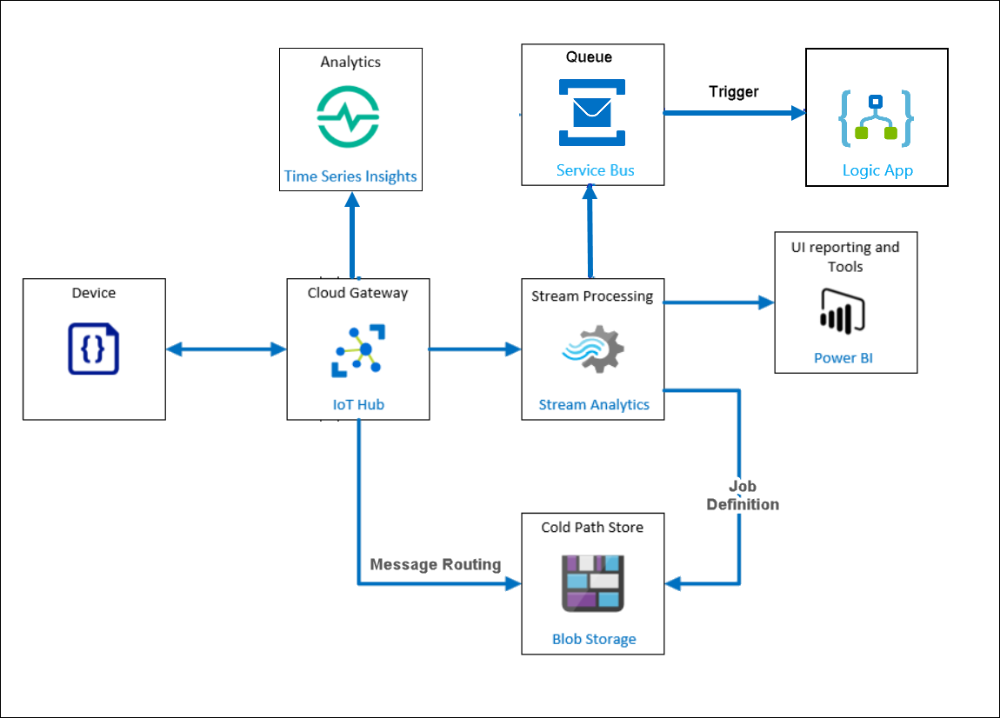

# Azure IoT in a Day Lab

Lab time: 180 minutes

## Fabrikam, Inc

Fabrikam, Inc. creates industrial equipment. Businesses require this critical equipment to be running at peak efficiency and utilization to realize their return on capital investments. These assets range from aircraft engines, turbines, elevators, industrial chillers, etc.

The recent international health crisis has forced them to explore how IoT solutions can help empower remote work and collaboration while increasing productivity and reducing operational expenses. 

Specifically, Fabrikam wants to build a customizable solution that can scale across their global operations. Also, they want to ensure their solution covers data store, processing, and analytics, be able to integrate intelligence both in the cloud and on-prem/edge and ensure the data can be integrated into their existing business applications. 

## Lab context

Fabrikam, Inc.’s Chief Technology Officer has evaluated the business opportunity for implementing IoT and has concluded that they can realize significant benefits by implementing the Azure IoT solution.

You are one of the team members selected by the CTO to become familiar with the Azure tools and put together a quick proof of concept.

In this lab, you will go through the various problem statements. The environment is already set up to focus on some of the core capabilities around Azure IoT.

Below is the diagram of the **Solution architecture** that you will implement in this lab.

## Exercise 1 - Getting Started with Azure IoT Services

In this exercise, you will connect devices deployed across the globe to Azure IoT Hub and manage all the devices centrally in a reliable/scalable fashion. 

And configure the solution to receive telemetry.

## Exercise 2 - Processing Data from Azure IoT Hub

In this exercise, you will use Azure Stream Analytics to process and transform the data in IoT Hub.

Also, store all data in the long term storage for cold path analysis and filter a subset of the telemetry data for real-time analysis and visualization on the hot path in PowerBI.

## Exercise 3 - Machine Learning in IoT and Real-Time Monitoring using Power BI

In this exercise, you will use automated in-built Machine Learning models to analyze the data and detect anomalies instead of manual involvement to detect anomalies.

And also you will use the output from the query which detects an anomaly in the first task to visualize the data in a Power BI dashboard and configure alerts as well which will be an optional task.

## Exercise 4 - Getting started with Azure IoT Edge

In this exercise, you will deploy a Stream Analytics module to the Edge device and generate an alert notification if process control values are exceeded.

## Exercise 5 - Securing the IoT Solution

In this exercise, you will secure the IoT Solution you have built by enabling the Azure Security Center for IoT and configuring the custom alerts.
